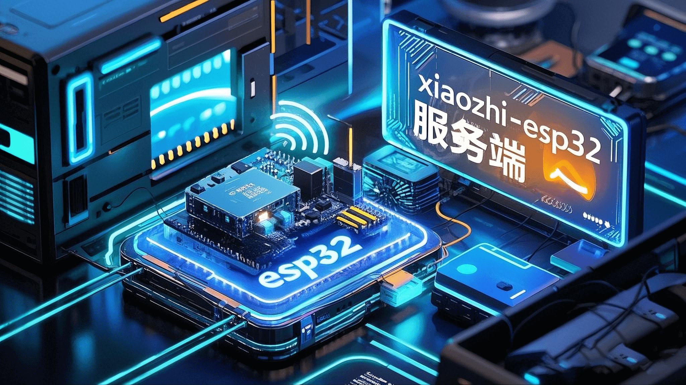
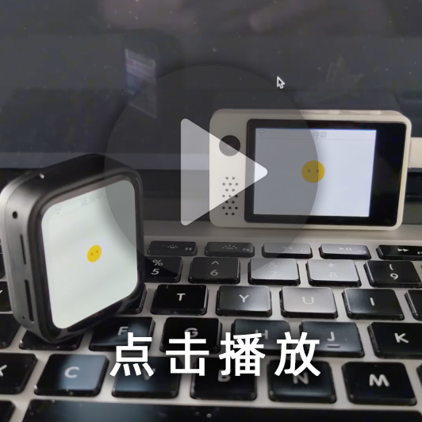
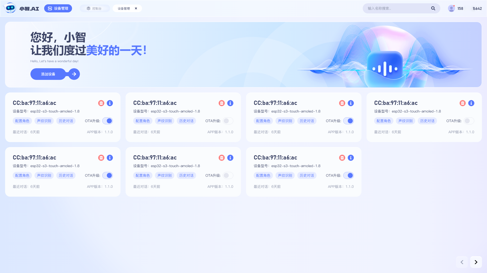

# 小智 ESP-32 后端服务(xiaozhi-esp32-server)

（中文 | [English](README_en.md)）

本项目为开源智能硬件项目 [xiaozhi-esp32](https://github.com/78/xiaozhi-esp32)
提供后端服务。根据 [小智通信协议](https://ccnphfhqs21z.feishu.cn/wiki/M0XiwldO9iJwHikpXD5cEx71nKh) 使用 `Python` 实现。

---

## 适用人群 👥

本项目需要配合 ESP32 硬件设备使用。如果您已经购买了 ESP32 相关硬件，且成功对接过虾哥部署的后端服务，并希望独立搭建自己的
`xiaozhi-esp32` 后端服务，那么本项目非常适合您。

跳转到[使用方式](#使用方式-)

想看使用效果？请猛戳这个视频 🎥

<a href="https://www.bilibili.com/video/BV1FMFyejExX">
 <picture>
   
 </picture>
</a>

---

## 系统要求与部署前提 🖥️

- **硬件**：一套兼容 `xiaozhi-esp32`
  的硬件设备（具体型号请参考 [此处](https://rcnv1t9vps13.feishu.cn/wiki/DdgIw4BUgivWDPkhMj1cGIYCnRf)）。
- **服务器**：至少 4 核 CPU、8G 内存的电脑或服务器。
- **固件编译**：请将后端服务的接口地址更新至 `xiaozhi-esp32` 项目中，再重新编译固件并烧录到设备上。

---

## 警告 ⚠️

本项目成立时间较短，还未通过网络安全测评，请勿在生产环境中使用。

如果您在公网环境中部署学习本项目，请务必在配置文件 `config.yaml` 中开启防护：

```yaml
server:
  auth:
    # 开启防护
    enabled: true  
```

开启防护后，您需要根据实际情况校验机器的 token 或 mac 地址，详细请参见配置说明。

---

## 功能清单 ✨

### 已实现 ✅

- **通信协议**  
  基于 `xiaozhi-esp32` 协议，通过 WebSocket 实现数据交互。
- **对话交互**  
  支持唤醒对话、手动对话及实时打断。长时间无对话时自动休眠
- **多语言识别**  
  支持国语、粤语、英语、日语、韩语（默认使用 FunASR）。
- **LLM 模块**  
  支持灵活切换 LLM 模块，默认使用 ChatGLMLLM，也可选用阿里百炼、DeepSeek、Ollama 等接口。
- **TTS 模块**  
  支持 EdgeTTS（默认）、火山引擎豆包 TTS 等多种 TTS 接口，满足语音合成需求。

### 正在开发 🚧

- 对话记忆功能
- 多种心情模式
- 智控台webui


---

## 本项目支持的平台/组件列表 📋

### LLM

| 类型  |        平台名称        |         使用方式          |   收费模式   |                                备注                                 |
|:---:|:------------------:|:---------------------:|:--------:|:-----------------------------------------------------------------:|
| LLM |   阿里百炼 (AliLLM)    |      openai 接口调用      | 消耗 token |  [点击申请密钥](https://bailian.console.aliyun.com/?apiKey=1#/api-key)  |
| LLM | 深度求索 (DeepSeekLLM) |      openai 接口调用      | 消耗 token |             [点击申请密钥](https://platform.deepseek.com/)              |
| LLM |   智谱（ChatGLMLLM）   |      openai 接口调用      |    免费    | 虽然免费，仍需[点击申请密钥](https://bigmodel.cn/usercenter/proj-mgmt/apikeys) |
| LLM |     OllamaLLM      |      ollama 接口调用      |  免费/自定义  |       需预先下载模型（`ollama pull`），服务地址：`http://localhost:11434`        |
| LLM |      DifyLLM       |       dify 接口调用       | 消耗 token |                    本地化部署，注意配置提示词需在 Dify 控制台设置                     |
| LLM |     GeminiLLM      |      gemini 接口调用      |    免费    |           [点击申请密钥](https://aistudio.google.com/apikey)            |
| LLM |      CozeLLM       |       coze 接口调用       | 消耗 token |                     需提供 bot_id、user_id 及个人令牌                      |
| LLM |   Home Assistant   | homeassistant语音助手接口调用 |    免费    |                        需提供home assistant令牌                        |

实际上，任何支持 openai 接口调用的 LLM 均可接入使用。

---

### TTS

| 类型  |          平台名称          | 使用方式 |   收费模式   |                                    备注                                     |
|:---:|:----------------------:|:----:|:--------:|:-------------------------------------------------------------------------:|
| TTS |        EdgeTTS         | 接口调用 |    免费    |                             默认 TTS，基于微软语音合成技术                             |
| TTS | 火山引擎豆包 TTS (DoubaoTTS) | 接口调用 | 消耗 token | [点击创建密钥](https://console.volcengine.com/speech/service/8)；建议使用付费版本以获得更高并发 |
| TTS |  CosyVoiceSiliconflow  | 接口调用 | 消耗 token |                         需申请硅基流动 API 密钥；输出格式为 wav                          |
| TTS |       CozeCnTTS        | 接口调用 | 消耗 token |                        需提供 Coze API key；输出格式为 wav                         |
| TTS |       FishSpeech       | 接口调用 |  免费/自定义  |                         本地启动 TTS 服务；启动方法见配置文件内说明                          |
| TTS |     GPT_SOVITS_V2      | 接口调用 |  免费/自定义  |                         本地启动 TTS 服务，适用于个性化语音合成场景                          |

---

### VAD

| 类型  |   平台名称    | 使用方式 | 收费模式 | 备注 |
|:---:|:---------:|:----:|:----:|:--:|
| VAD | SileroVAD | 本地使用 |  免费  |    |

---

### ASR

| 类型  |  平台名称  | 使用方式 | 收费模式 | 备注 |
|:---:|:------:|:----:|:----:|:--:|
| ASR | FunASR | 本地使用 |  免费  |    |

---

## 使用方式 🚀

### 一、[部署文档](./docs/Deployment.md)

1.**[本地源码运行](./docs/Deployment.md#%E6%96%B9%E5%BC%8F%E4%B8%89%E6%9C%AC%E5%9C%B0%E6%BA%90%E7%A0%81%E8%BF%90%E8%A1%8C)**
  
适合熟悉 Conda 环境或希望从零搭建运行环境的用户。  
对于对响应速度要求较高的场景，推荐使用本地源码运行方式以降低额外开销。

### 二、[固件编译](./docs/firmware-build.md)

点这里查看[固件编译](./docs/firmware-build.md)的详细过程。

编译成功且联网成功后，通过唤醒词唤醒小智，留意server端输出的控制台信息。

---

## 常见问题 ❓

### 1、TTS 经常失败，经常超时 ⏰

建议：如果 `EdgeTTS` 经常失败，请先检查是否使用了代理（梯子）。如果使用了，请尝试关闭代理后再试；  
如果用的是火山引擎的豆包 TTS，经常失败时建议使用付费版本，因为测试版本仅支持 2 个并发。

### 2、我想通过小智控制电灯、空调、远程开关机等操作 💡

建议：在配置文件中将 `LLM` 设置为 `HomeAssistant`，通过 调用`HomeAssistant`接口实现相关控制。

### 3、我说话很慢，停顿时小智老是抢话 🗣️

建议：在配置文件中找到如下部分，将 `min_silence_duration_ms` 的值调大（例如改为 `1000`）：

```yaml
VAD:
  SileroVAD:
    threshold: 0.5
    model_dir: models/snakers4_silero-vad
    min_silence_duration_ms: 700  # 如果说话停顿较长，可将此值调大
```

### 4、为什么我说的话，小智识别出来很多韩文、日文、英文？🇰🇷

建议：检查一下`models/SenseVoiceSmall`是否已经有`model.pt`文件，如果没有就要下载，查看这里[下载语音识别模型文件](docs/Deployment.md#模型文件)

### 5、为什么会出现“TTS 任务出错 文件不存在”？📁

建议：检查一下是否正确使用`conda` 安装了`libopus`和`ffmpeg`库。

如果没有安装，就安装
```
conda install conda-forge::libopus
conda install conda-forge::ffmpeg
```

### 6、如何提高小智对话响应速度？ ⚡

本项目默认配置为低成本方案，建议初学者先使用默认免费模型，解决“跑得动”的问题，再优化“跑得快”。  
如需提升响应速度，可尝试更换各组件。以下为各组件的响应速度测试数据（仅供参考，不构成承诺）：

| 影响因素  |       因素值        | 
|:-----:|:----------------:|
| 测试地点  |    广东省广州市海珠区     |
| 测试时间  | 2025年2月19日 12:52 |
| 宽带运营商 |       中国联通       |

测试方法：

1、把各组件的密钥配置上去，只有配置了密钥的组件才参与测试。

2、配置完密钥后，执行以下方法

```
# 进入项目根目录，执行以下命令：
conda activate xiaozhi-esp32-server
python performance_tester.py 
```

生成报告如下

LLM 性能排行:

| 模块名称       | 平均首Token时间 | 平均总响应时间 |
|:-----------|:-----------|:--------|
| AliLLM     | 0.547s     | 1.485s  |
| ChatGLMLLM | 0.677s     | 3.057s  |
| OllamaLLM  | 0.003s     | 0.003s  |

TTS 性能排行:

| 模块名称                 | 平均合成时间 |
|----------------------|--------|
| EdgeTTS              | 1.019s |
| DoubaoTTS            | 0.503s |
| CosyVoiceSiliconflow | 3.732s |

推荐配置组合 (综合响应速度):

| 组合方案                          | 综合得分  | LLM首Token | TTS合成  |
|-------------------------------|-------|-----------|--------|
| AliLLM + DoubaoTTS            | 0.539 | 0.547s    | 0.503s |
| AliLLM + EdgeTTS              | 0.642 | 0.547s    | 1.019s |
| ChatGLMLLM + DoubaoTTS        | 0.642 | 0.677s    | 0.503s |
| ChatGLMLLM + EdgeTTS          | 0.745 | 0.677s    | 1.019s |
| AliLLM + CosyVoiceSiliconflow | 1.184 | 0.547s    | 3.732s |

### 结论 🔍

`2025年2月19日`，如果我的电脑在`广东省广州市海珠区`，且使用的是`中国联通`网络，我会优先使用：

- LLM：`AliLLM`
- TTS：`DoubaoTTS`

### 7、更多问题，可联系我们反馈 💬


---

## 鸣谢 🙏

- 本项目受 [百聆语音对话机器人](https://github.com/wwbin2017/bailing) 启发，并在其基础上实现。
- 感谢 [腾讯云](https://cloud.tencent.com/) 提供免费 Docker 镜像空间。
- 感谢 [十方融海](https://www.tenclass.com/) 对小智通讯协议提供的详尽文档支持。

<a href="https://star-history.com/#xinnan-tech/xiaozhi-esp32-server&Date">
 <picture>
   <source media="(prefers-color-scheme: dark)" srcset="https://api.star-history.com/svg?repos=xinnan-tech/xiaozhi-esp32-server&type=Date&theme=dark" />
   <source media="(prefers-color-scheme: light)" srcset="https://api.star-history.com/svg?repos=xinnan-tech/xiaozhi-esp32-server&type=Date" />
   
 </picture>
</a>