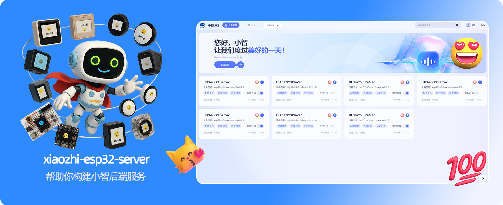
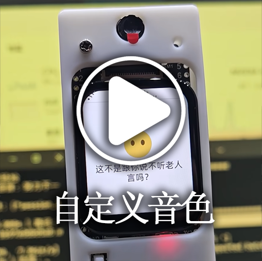
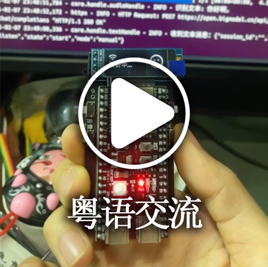
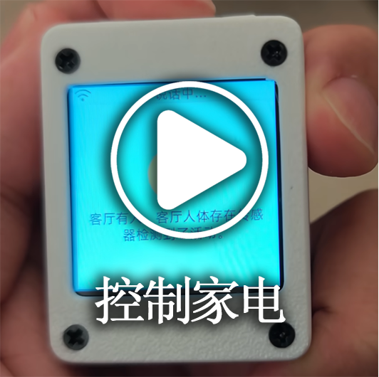
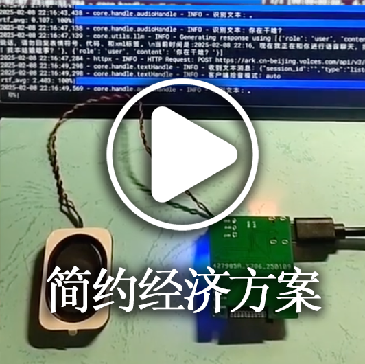

[](https://github.com/xinnan-tech/xiaozhi-esp32-server)

<center>
<h1>Xiaozhi Backend Server xiaozhi-esp32-server</h1>
</center>

<p align="center">
This project provides backend services for the open-source smart hardware project
<a href="https://github.com/78/xiaozhi-esp32">xiaozhi-esp32</a><br/>
Implemented in Python according to the <a href="https://ccnphfhqs21z.feishu.cn/wiki/M0XiwldO9iJwHikpXD5cEx71nKh">Xiaozhi Communication Protocol</a><br/>
Helping you quickly set up your Xiaozhi server
</p>

<p align="center">
<a href="./README.md">简体中文</a>
· English
· <a href="https://github.com/xinnan-tech/xiaozhi-esp32-server/releases">Changelog</a>
· <a href="./docs/Deployment.md">Deployment Guide</a>
· <a href="https://github.com/xinnan-tech/xiaozhi-esp32-server/issues">Report Issues</a>
</p>
<p align="center">
  <a href="https://github.com/xinnan-tech/xiaozhi-esp32-server/releases">
    
  </a>
  <a href="https://github.com/xinnan-tech/xiaozhi-esp32-server/graphs/contributors">
    
  </a>
  <a href="https://github.com/xinnan-tech/xiaozhi-esp32-server/issues">
    
  </a>
  <a href="https://github.com/xinnan-tech/xiaozhi-esp32-server/pulls">
    
  </a>
  <a href="https://github.com/xinnan-tech/xiaozhi-esp32-server/pulls">
    
  </a>
  <a href="https://github.com/xinnan-tech/xiaozhi-esp32-server">
    
  </a>
</p>

---

## Target Users 👥

This project requires ESP32 hardware devices. If you have purchased ESP32-related hardware, successfully connected to Brother Xia's backend service, and wish to set up your own `xiaozhi-esp32` backend service, then this project is perfect for you.

Want to see it in action? Check out these videos 🎥

<table>
  <tr>
    <td>
        <a href="https://www.bilibili.com/video/BV1FMFyejExX" target="_blank">
         <picture>
           
         </picture>
        </a>
    </td>
    <td>
        <a href="https://www.bilibili.com/video/BV1CDKWemEU6" target="_blank">
         <picture>
           
         </picture>
        </a>
    </td>
    <td>
        <a href="https://www.bilibili.com/video/BV12yA2egEaC" target="_blank">
         <picture>
           
         </picture>
        </a>
    </td>
    <td>
        <a href="https://www.bilibili.com/video/BV1pNXWYGEx1" target="_blank">
         <picture>
           
         </picture>
        </a>
    </td>
    <td>
        <a href="https://www.bilibili.com/video/BV1kgA2eYEQ9" target="_blank">
         <picture>
           
         </picture>
        </a>
    </td>
  </tr>
  <tr>
    <td>
        <a href="https://www.bilibili.com/video/BV1Vy96YCE3R" target="_blank">
         <picture>
           
         </picture>
        </a>
    </td>
    <td>
        <a href="https://www.bilibili.com/video/BV1VC96Y5EMH" target="_blank">
         <picture>
           
         </picture>
        </a>
    </td>
    <td>
        <a href="https://www.bilibili.com/video/BV1Z8XuYZEAS" target="_blank">
         <picture>
           
         </picture>
        </a>
    </td>
    <td>
        <a href="https://www.bilibili.com/video/BV178XuYfEpi" target="_blank">
         <picture>
           
         </picture>
        </a>
    </td>
    <td>
        <a href="https://www.bilibili.com/video/BV17LXWYvENb" target="_blank">
         <picture>
           
         </picture>
        </a>
    </td>
  </tr>
</table>

---

## System Requirements and Prerequisites 🖥️

- **Computer or Server**: Recommended 4-core CPU, 8GB RAM computer. If using ASR with API, can run on a 2-core CPU, 2GB RAM server.
- **Update Client Interface**: Please update the backend service interface address in the client.

---

## Warning ⚠️

1. This is open-source software. This software and any third-party API service providers it interfaces with (including but not limited to speech recognition, large language models, speech synthesis, and other platforms) have no commercial partnership. We do not provide any form of guarantee for their service quality or financial security.
We recommend users prioritize service providers with relevant business licenses and carefully read their service agreements and privacy policies. This software does not host any account keys, does not participate in fund transfers, and does not bear the risk of recharge fund losses.

2. This project is relatively new and has not yet passed network security testing. Please do not use it in production environments. If you deploy this project for learning purposes in a public network environment, please make sure to enable protection in the `config.yaml` configuration file:

```yaml
server:
  auth:
    # Enable protection
    enabled: true  
```

After enabling protection, you need to verify the machine's token or MAC address according to actual circumstances. Please refer to the configuration documentation for details.

---

## Deployment Methods 🚀

### I. [Deployment Guide](./docs/Deployment.md)

This project supports three deployment methods. You can choose based on your actual needs.

1. [Quick Docker Deployment](./docs/Deployment.md)

Suitable for regular users who want to quickly experience without much environment configuration. The downside is that pulling the image can be slow. Video tutorial available: [Beautiful expert teaches Docker deployment](https://www.bilibili.com/video/BV1RNQnYDE5t)

2. [Deploy Using Docker Environment](./docs/Deployment.md#%E6%96%B9%E5%BC%8F%E4%BA%8C%E5%80%9F%E5%8A%A9docker%E7%8E%AF%E5%A2%83%E8%BF%90%E8%A1%8C%E9%83%A8%E7%BD%B2)

For software engineers who have Docker installed and want to make custom code modifications.

3. [Local Source Code Run](./docs/Deployment.md#%E6%96%B9%E5%BC%8F%E4%B8%89%E6%9C%AC%E5%9C%B0%E6%BA%90%E7%A0%81%E8%BF%90%E8%A1%8C)

Suitable for users familiar with `Conda` environment or who want to build the running environment from scratch.

For scenarios requiring higher response speed, we recommend using the local source code run method to reduce additional overhead. Video tutorial available: [Handsome expert teaches source code deployment](https://www.bilibili.com/video/BV1GvQWYZEd2)

### II. [Firmware Compilation](./docs/firmware-build.md)

Click here to view the detailed process of [firmware compilation](./docs/firmware-build.md).

After successful flashing and network connection, wake up Xiaozhi using the wake word and pay attention to the console output on the server side.

---

## Common Questions ❓

For issues or product suggestions, please [click here](docs/FAQ.md).

---

## Product Ecosystem 👬
Xiaozhi is an ecosystem. When using this product, you might want to check out other excellent projects in this ecosystem:

- [Xiaozhi Android Client](https://github.com/TOM88812/xiaozhi-android-client)
  A voice dialogue application based on xiaozhi-server for Android and iOS, supporting real-time voice interaction and text dialogue. Now in Flutter version, supporting both iOS and Android.
- [Xiaozhi PC Client](https://github.com/Huang-junsen/py-xiaozhi)
  This project provides a Python-based Xiaobai AI client, allowing you to experience Xiaozhi AI features through code even without physical hardware. Main features include AI voice interaction, visual multimodal recognition, IoT device integration, online music playback, voice wake-up, automatic dialogue mode, graphical interface, command-line mode, cross-platform support, volume control, session management, encrypted audio transmission, automatic verification code processing, etc.
- [Xiaozhi Java Server](https://github.com/joey-zhou/xiaozhi-esp32-server-java) 

  The Xiaozhi open-source backend service Java version is a Java-based open-source project that includes both frontend and backend services, aiming to provide users with a complete backend service solution.
---
## Feature List ✨

### Implemented ✅

- **Communication Protocol**  
  Based on `xiaozhi-esp32` protocol, implementing data interaction through WebSocket.
- **Dialogue Interaction**  
  Supports wake-up dialogue, manual dialogue, and real-time interruption. Automatically sleeps after long periods without dialogue
- **Intent Recognition**  
  Supports LLM intent recognition and function call, reducing hard-coded intent judgment
- **Multi-language Recognition**  
  Supports Mandarin, Cantonese, English, Japanese, Korean (default using FunASR).
- **LLM Module**  
  Supports flexible switching of LLM modules, default using ChatGLMLLM, can also use Alibaba Bailian, DeepSeek, Ollama, and other interfaces.
- **TTS Module**  
  Supports EdgeTTS (default), Volcano Engine Doubao TTS, and other TTS interfaces to meet speech synthesis needs.
- **Memory Function**  
  Supports ultra-long memory, local summary memory, and no memory modes to meet different scenario needs.
- **IOT Function**  
  Supports managing registered device IOT functions, supporting intelligent IoT control based on dialogue context.

### Under Development 🚧

- Multiple mood modes
- Smart control panel webui

To learn about specific development progress, [click here](https://github.com/users/xinnan-tech/projects/3)

If you are a software developer, here's an [Open Letter to Developers](docs/contributor_open_letter.md), welcome to join!

---

## Supported Platforms/Components List 📋

### LLM Language Models

| Usage Method | Supported Platforms | Free Platforms |
|:---:|:---:|:---:|
| openai interface call | Alibaba Bailian, Volcano Engine Doubao, DeepSeek, Zhipu ChatGLM, Gemini | Zhipu ChatGLM, Gemini |
| ollama interface call | Ollama | - |
| dify interface call | Dify | - |
| fastgpt interface call | Fastgpt | - |
| coze interface call | Coze | - |

In fact, any LLM supporting openai interface calls can be integrated.

---

### TTS Speech Synthesis

| Usage Method | Supported Platforms | Free Platforms |
|:---:|:---:|:---:|
| Interface Call | EdgeTTS, Volcano Engine Doubao TTS, Tencent Cloud, Alibaba Cloud TTS, CosyVoiceSiliconflow, TTS302AI, CozeCnTTS, GizwitsTTS, ACGNTTS, OpenAITTS | EdgeTTS, CosyVoiceSiliconflow(partial) |
| Local Service | FishSpeech, GPT_SOVITS_V2, GPT_SOVITS_V3, MinimaxTTS | FishSpeech, GPT_SOVITS_V2, GPT_SOVITS_V3, MinimaxTTS |

---

### VAD Voice Activity Detection

| Type | Platform Name | Usage Method | Pricing Model | Notes |
|:---:|:---------:|:----:|:----:|:--:|
| VAD | SileroVAD | Local Use | Free | |

---

### ASR Speech Recognition

| Usage Method | Supported Platforms | Free Platforms |
|:---:|:---:|:---:|
| Local Use | FunASR, SherpaASR | FunASR, SherpaASR |
| Interface Call | DoubaoASR | - |

---

### Memory Storage

| Type | Platform Name | Usage Method | Pricing Model | Notes |
|:------:|:---------------:|:----:|:---------:|:--:|
| Memory | mem0ai | Interface Call | 1000 times/month quota | |
| Memory | mem_local_short | Local Summary | Free | |

---

### Intent Recognition

| Type | Platform Name | Usage Method | Pricing Model | Notes |
|:------:|:-------------:|:----:|:-------:|:---------------------:|
| Intent | intent_llm | Interface Call | Based on LLM pricing | Intent recognition through large models, highly generalizable |
| Intent | function_call | Interface Call | Based on LLM pricing | Intent completion through large model function calls, fast and effective |

---

## Acknowledgments 🙏

- This project was inspired by [Bailing Voice Dialogue Robot](https://github.com/wwbin2017/bailing) and implemented based on it.
- Thanks to [Tenclass](https://www.tenclass.com/) for providing detailed documentation support for the Xiaozhi communication protocol.

<a href="https://star-history.com/#xinnan-tech/xiaozhi-esp32-server&Date">
 <picture>
   <source media="(prefers-color-scheme: dark)" srcset="https://api.star-history.com/svg?repos=xinnan-tech/xiaozhi-esp32-server&type=Date&theme=dark" />
   <source media="(prefers-color-scheme: light)" srcset="https://api.star-history.com/svg?repos=xinnan-tech/xiaozhi-esp32-server&type=Date" />
   
 </picture>
</a> 