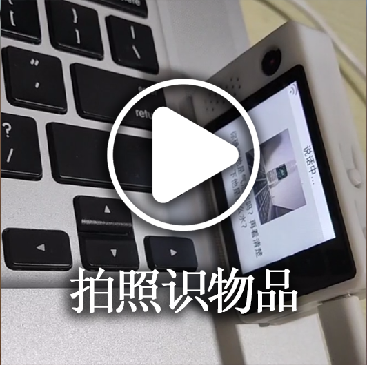
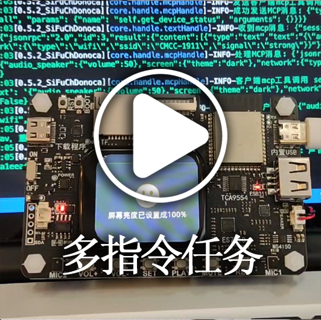

[](https://github.com/xinnan-tech/xiaozhi-esp32-server)

<h1 align="center">Xiaozhi Backend Service xiaozhi-esp32-server</h1>

<p align="center">
This project is based on human-machine symbiotic intelligence theory and technology to develop intelligent terminal hardware and software systems<br/>providing backend services for the open-source intelligent hardware project
<a href="https://github.com/78/xiaozhi-esp32">xiaozhi-esp32</a><br/>
Implemented using Python, Java, and Vue according to the <a href="https://ccnphfhqs21z.feishu.cn/wiki/M0XiwldO9iJwHikpXD5cEx71nKh">Xiaozhi Communication Protocol</a><br/>
Supports MCP endpoints and voiceprint recognition
</p>

<p align="center">
<a href="./README.md">中文</a>
· <a href="./docs/FAQ.md">FAQ</a>
· <a href="https://github.com/xinnan-tech/xiaozhi-esp32-server/issues">Report Issues</a>
· <a href="./README.md#%E9%83%A8%E7%BD%B2%E6%96%87%E6%A1%A3">Deployment Docs</a>
· <a href="https://github.com/xinnan-tech/xiaozhi-esp32-server/releases">Release Notes</a>
</p>
<p align="center">
  <a href="https://github.com/xinnan-tech/xiaozhi-esp32-server/releases">
    
  </a>
  <a href="https://github.com/xinnan-tech/xiaozhi-esp32-server/graphs/contributors">
    
  </a>
  <a href="https://github.com/xinnan-tech/xiaozhi-esp32-server/issues">
    
  </a>
  <a href="https://github.com/xinnan-tech/xiaozhi-esp32-server/pulls">
    
  </a>
  <a href="https://github.com/xinnan-tech/xiaozhi-esp32-server/blob/main/LICENSE">
    
  </a>
  <a href="https://github.com/xinnan-tech/xiaozhi-esp32-server">
    
  </a>
</p>

<p align="center">
By Professor Siyuan Liu Research and Development Group (South China University of Technology)
</br>
刘思源教授团队研发（华南理工大学）
</br>

</p>

---

## Target Users 👥

This project requires ESP32 hardware devices to work. If you have purchased ESP32-related hardware, successfully connected to Brother Xia's deployed backend service, and want to build your own `xiaozhi-esp32` backend service independently, then this project is perfect for you.

Want to see the usage effects? Click the videos below 🎥

<table>
  <tr>
    <td>
        <a href="https://www.bilibili.com/video/BV1FMFyejExX" target="_blank">
         <picture>
           
         </picture>
        </a>
    </td>
    <td>
        <a href="https://www.bilibili.com/video/BV1CDKWemEU6" target="_blank">
         <picture>
           
         </picture>
        </a>
    </td>
    <td>
        <a href="https://www.bilibili.com/video/BV12yA2egEaC" target="_blank">
         <picture>
           
         </picture>
        </a>
    </td>
    <td>
        <a href="https://www.bilibili.com/video/BV1pNXWYGEx1" target="_blank">
         <picture>
           
         </picture>
        </a>
    </td>
    <td>
        <a href="https://www.bilibili.com/video/BV1kgA2eYEQ9" target="_blank">
         <picture>
           
         </picture>
        </a>
    </td>
  </tr>
  <tr>
    <td>
        <a href="https://www.bilibili.com/video/BV1Vy96YCE3R" target="_blank">
         <picture>
           
         </picture>
        </a>
    </td>
    <td>
        <a href="https://www.bilibili.com/video/BV1VC96Y5EMH" target="_blank">
         <picture>
           
         </picture>
        </a>
    </td>
    <td>
        <a href="https://www.bilibili.com/video/BV1Z8XuYZEAS" target="_blank">
         <picture>
           
         </picture>
        </a>
    </td>
    <td>
        <a href="https://www.bilibili.com/video/BV178XuYfEpi" target="_blank">
         <picture>
           
         </picture>
        </a>
    </td>
    <td>
        <a href="https://www.bilibili.com/video/BV17LXWYvENb" target="_blank">
         <picture>
           
         </picture>
        </a>
    </td>
  </tr>
  <tr>
    <td>
      <a href="https://www.bilibili.com/video/BV12J7WzBEaH" target="_blank">
         <picture>
           
         </picture>
        </a>
    </td>
    <td>
      <a href="https://www.bilibili.com/video/BV1Co76z7EvK" target="_blank">
         <picture>
           
         </picture>
        </a>
    </td>
    <td>
      <a href="https://www.bilibili.com/video/BV1TJ7WzzEo6" target="_blank">
         <picture>
           
         </picture>
        </a>
    </td>
    <td>
        <a href="https://www.bilibili.com/video/BV1ZQKUzYExM" target="_blank">
         <picture>
           
         </picture>
        </a>
    </td>
    <td>
        <a href="https://www.bilibili.com/video/BV1Exu3zqEDe" target="_blank">
         <picture>
           
         </picture>
        </a>
    </td>
  </tr>
</table>

---

## Warnings ⚠️

1. This project is open-source software. This software has no commercial partnership with any third-party API service providers (including but not limited to speech recognition, large models, speech synthesis, and other platforms) that it interfaces with, and does not provide any form of guarantee for their service quality or financial security. It is recommended that users prioritize service providers with relevant business licenses and carefully read their service agreements and privacy policies. This software does not host any account keys, does not participate in fund flows, and does not bear the risk of recharge fund losses.

2. The functionality of this project is not complete and has not passed network security assessment. Please do not use it in production environments. If you deploy this project for learning purposes in a public network environment, please ensure necessary protection measures are in place.

---

## Deployment Documentation


This project provides two deployment methods. Please choose based on your specific needs:

#### 🚀 Deployment Method Selection
| Deployment Method | Features | Applicable Scenarios | Deployment Docs | Configuration Requirements | Video Tutorials | 
|---------|------|---------|---------|---------|---------|
| **Simplified Installation** | Intelligent dialogue, IOT, MCP, visual perception | Low-configuration environments, data stored in config files, no database required | [①Docker Version](./docs/Deployment.md#%E6%96%B9%E5%BC%8F%E4%B8%80docker%E5%8F%AA%E8%BF%90%E8%A1%8Cserver) / [②Source Code Deployment](./docs/Deployment.md#%E6%96%B9%E5%BC%8F%E4%BA%8C%E6%9C%AC%E5%9C%B0%E6%BA%90%E7%A0%81%E5%8F%AA%E8%BF%90%E8%A1%8Cserver)| 2 cores 4GB if using `FunASR`, 2 cores 2GB if all APIs | - | 
| **Full Module Installation** | Intelligent dialogue, IOT, MCP endpoints, voiceprint recognition, visual perception, OTA, intelligent control console | Complete functionality experience, data stored in database |[①Docker Version](./docs/Deployment_all.md#%E6%96%B9%E5%BC%8F%E4%B8%80docker%E8%BF%90%E8%A1%8C%E5%85%A8%E6%A8%A1%E5%9D%97) / [②Source Code Deployment](./docs/Deployment_all.md#%E6%96%B9%E5%BC%8F%E4%BA%8C%E6%9C%AC%E5%9C%B0%E6%BA%90%E7%A0%81%E8%BF%90%E8%A1%8C%E5%85%A8%E6%A8%A1%E5%9D%97) / [③Source Code Deployment Auto-Update Tutorial](./docs/dev-ops-integration.md) | 4 cores 8GB if using `FunASR`, 2 cores 4GB if all APIs| [Local Source Code Startup Video Tutorial](https://www.bilibili.com/video/BV1wBJhz4Ewe) | 


> 💡 Note: Below is a test platform deployed with the latest code. You can burn and test if needed. Concurrent users: 6, data will be cleared daily.

```
Intelligent Control Console Address: https://2662r3426b.vicp.fun

Service Test Tool: https://2662r3426b.vicp.fun/test/
OTA Interface Address: https://2662r3426b.vicp.fun/xiaozhi/ota/
Websocket Interface Address: wss://2662r3426b.vicp.fun/xiaozhi/v1/
```

#### 🚩 Configuration Description and Recommendations
> [!Note]
> This project provides two configuration schemes:
> 
> 1. `Entry Level Free Settings`: Suitable for personal and home use, all components use free solutions, no additional payment required.
> 
> 2. `Streaming Configuration`: Suitable for demonstrations, training, scenarios with more than 2 concurrent users, etc. Uses streaming processing technology for faster response speed and better experience.
> 
> Starting from version `0.5.2`, the project supports streaming configuration. Compared to earlier versions, response speed is improved by approximately `2.5 seconds`, significantly improving user experience.

| Module Name | Entry Level Free Settings | Streaming Configuration |
|:---:|:---:|:---:|
| ASR(Speech Recognition) | FunASR(Local) | 👍FunASRServer or 👍DoubaoStreamASR |
| LLM(Large Model) | ChatGLMLLM(Zhipu glm-4-flash) | 👍DoubaoLLM(Volcano doubao-1-5-pro-32k-250115) |
| VLLM(Vision Large Model) | ChatGLMVLLM(Zhipu glm-4v-flash) | 👍QwenVLVLLM(Qwen qwen2.5-vl-3b-instructh) |
| TTS(Speech Synthesis) | ✅LinkeraiTTS(Lingxi streaming) | 👍HuoshanDoubleStreamTTS(Volcano dual-stream speech synthesis) |
| Intent(Intent Recognition) | function_call(Function calling) | function_call(Function calling) |
| Memory(Memory function) | mem_local_short(Local short-term memory) | mem_local_short(Local short-term memory) |

#### 🔧 Testing Tools
This project provides the following testing tools to help you verify the system and choose suitable models:

| Tool Name | Location | Usage Method | Function Description |
|:---:|:---|:---:|:---:|
| Audio Interaction Test Tool | main》xiaozhi-server》test》test_page.html | Open directly with Google Chrome | Tests audio playback and reception functions, verifies if Python-side audio processing is normal |
| Model Response Test Tool 1 | main》xiaozhi-server》performance_tester.py | Execute `python performance_tester.py` | Tests response speed of three core modules: ASR(speech recognition), LLM(large model), TTS(speech synthesis) |
| Model Response Test Tool 2 | main》xiaozhi-server》performance_tester_vllm.py | Execute `python performance_tester_vllm.py` | Tests VLLM(vision model) response speed |

> 💡 Note: When testing model speed, only models with configured keys will be tested.

---
## Feature List ✨
### Implemented ✅

| Feature Module | Description |
|:---:|:---|
| Core Architecture | Based on WebSocket and HTTP servers, provides complete console management and authentication system |
| Voice Interaction | Supports streaming ASR(speech recognition), streaming TTS(speech synthesis), VAD(voice activity detection), supports multi-language recognition and voice processing |
| Voiceprint Recognition | Supports multi-user voiceprint registration, management, and recognition, processes in parallel with ASR, real-time speaker identity recognition and passes to LLM for personalized responses |
| Intelligent Dialogue | Supports multiple LLM(large language models), implements intelligent dialogue |
| Visual Perception | Supports multiple VLLM(vision large models), implements multimodal interaction |
| Intent Recognition | Supports LLM intent recognition, Function Call function calling, provides plugin-based intent processing mechanism |
| Memory System | Supports local short-term memory, mem0ai interface memory, with memory summarization functionality |
| Tool Calling | Supports client IOT protocol, client MCP protocol, server MCP protocol, MCP endpoint protocol, custom tool functions |
| Management Backend | Provides Web management interface, supports user management, system configuration, and device management |
| Testing Tools | Provides performance testing tools, vision model testing tools, and audio interaction testing tools |
| Deployment Support | Supports Docker deployment and local deployment, provides complete configuration file management |
| Plugin System | Supports functional plugin extensions, custom plugin development, and plugin hot-loading |

### Under Development 🚧

To learn about specific development plan progress, [click here](https://github.com/users/xinnan-tech/projects/3)

If you are a software developer, here is an [Open Letter to Developers](docs/contributor_open_letter.md). Welcome to join!

---

## Product Ecosystem 👬
Xiaozhi is an ecosystem. When using this product, you can also check out other excellent projects in this ecosystem

| Project Name | Project Address | Project Description |
|:---------------------|:--------|:--------|
| Xiaozhi Android Client | [xiaozhi-android-client](https://github.com/TOM88812/xiaozhi-android-client) | An Android and iOS voice dialogue application based on xiaozhi-server, supporting real-time voice interaction and text dialogue.<br/>Currently a Flutter version, connecting iOS and Android platforms. |
| Xiaozhi Desktop Client | [py-xiaozhi](https://github.com/Huang-junsen/py-xiaozhi) | This project provides a Python-based AI client for beginners, allowing users to experience Xiaozhi AI functionality through code even without physical hardware conditions. |
| Xiaozhi Java Server | [xiaozhi-esp32-server-java](https://github.com/joey-zhou/xiaozhi-esp32-server-java) | Xiaozhi open-source backend service Java version is a Java-based open-source project.<br/>It includes frontend and backend services, aiming to provide users with a complete backend service solution. |

---

## Supported Platforms/Components List 📋

### LLM Language Models

| Usage Method | Supported Platforms | Free Platforms |
|:---:|:---:|:---:|
| OpenAI interface calls | Alibaba Bailian, Volcano Engine Doubao, DeepSeek, Zhipu ChatGLM, Gemini | Zhipu ChatGLM, Gemini |
| Ollama interface calls | Ollama | - |
| Dify interface calls | Dify | - |
| FastGPT interface calls | FastGPT | - |
| Coze interface calls | Coze | - |

In fact, any LLM that supports OpenAI interface calls can be integrated and used.

---

### VLLM Vision Models

| Usage Method | Supported Platforms | Free Platforms |
|:---:|:---:|:---:|
| OpenAI interface calls | Alibaba Bailian, Zhipu ChatGLMVLLM | Zhipu ChatGLMVLLM |

In fact, any VLLM that supports OpenAI interface calls can be integrated and used.

---

### TTS Speech Synthesis

| Usage Method | Supported Platforms | Free Platforms |
|:---:|:---:|:---:|
| Interface calls | EdgeTTS, Volcano Engine Doubao TTS, Tencent Cloud, Alibaba Cloud TTS, CosyVoiceSiliconflow, TTS302AI, CozeCnTTS, GizwitsTTS, ACGNTTS, OpenAITTS, Lingxi Streaming TTS | Lingxi Streaming TTS, EdgeTTS, CosyVoiceSiliconflow(partial) |
| Local services | FishSpeech, GPT_SOVITS_V2, GPT_SOVITS_V3, MinimaxTTS | FishSpeech, GPT_SOVITS_V2, GPT_SOVITS_V3, MinimaxTTS |

---

### VAD Voice Activity Detection

| Type | Platform Name | Usage Method | Pricing Model | Notes |
|:---:|:---------:|:----:|:----:|:--:|
| VAD | SileroVAD | Local use | Free | |

---

### ASR Speech Recognition

| Usage Method | Supported Platforms | Free Platforms |
|:---:|:---:|:---:|
| Local use | FunASR, SherpaASR | FunASR, SherpaASR |
| Interface calls | DoubaoASR, FunASRServer, TencentASR, AliyunASR | FunASRServer |

---

### Voiceprint Recognition

| Usage Method | Supported Platforms | Free Platforms |
|:---:|:---:|:---:|
| Local use | 3D-Speaker | 3D-Speaker |

---

### Memory Storage

| Type | Platform Name | Usage Method | Pricing Model | Notes |
|:------:|:---------------:|:----:|:---------:|:--:|
| Memory | mem0ai | Interface calls | 1000 times/month quota | |
| Memory | mem_local_short | Local summarization | Free | |

---

### Intent Recognition

| Type | Platform Name | Usage Method | Pricing Model | Notes |
|:------:|:-------------:|:----:|:-------:|:---------------------:|
| Intent | intent_llm | Interface calls | Based on LLM pricing | Recognizes intent through large models, strong generalization |
| Intent | function_call | Interface calls | Based on LLM pricing | Completes intent through large model function calling, fast speed, good effect |

---

## Acknowledgments 🙏

| Logo | Project/Company | Description |
|:---:|:---:|:---|
|  | [Bailing Voice Dialogue Robot](https://github.com/wwbin2017/bailing) | This project is inspired by [Bailing Voice Dialogue Robot](https://github.com/wwbin2017/bailing) and implemented on its basis |
|  | [Tenclass](https://www.tenclass.com/) | Thanks to [Tenclass](https://www.tenclass.com/) for formulating standard communication protocols, multi-device compatibility solutions, and high-concurrency scenario practice demonstrations for the Xiaozhi ecosystem; providing full-link technical documentation support for this project |
|  | [Xuanfeng Technology](https://github.com/Eric0308) | Thanks to [Xuanfeng Technology](https://github.com/Eric0308) for contributing function calling framework, MCP communication protocol, and plugin-based calling mechanism implementation code. Through standardized instruction scheduling system and dynamic expansion capabilities, it significantly improves the interaction efficiency and functional extensibility of frontend devices (IoT) |
|  | [Huiyuan Design](http://ui.kwd988.net/) | Thanks to [Huiyuan Design](http://ui.kwd988.net/) for providing professional visual solutions for this project, using their design practical experience serving over a thousand enterprises to empower this project's product user experience |
|  | [Xi'an Qinren Information Technology](https://www.029app.com/) | Thanks to [Xi'an Qinren Information Technology](https://www.029app.com/) for deepening this project's visual system, ensuring consistency and extensibility of overall design style in multi-scenario applications |


<a href="https://star-history.com/#xinnan-tech/xiaozhi-esp32-server&Date">

 <picture>
   <source media="(prefers-color-scheme: dark)" srcset="https://api.star-history.com/svg?repos=xinnan-tech/xiaozhi-esp32-server&type=Date&theme=dark" />
   <source media="(prefers-color-scheme: light)" srcset="https://api.star-history.com/svg?repos=xinnan-tech/xiaozhi-esp32-server&type=Date" />
   
 </picture>
</a>
