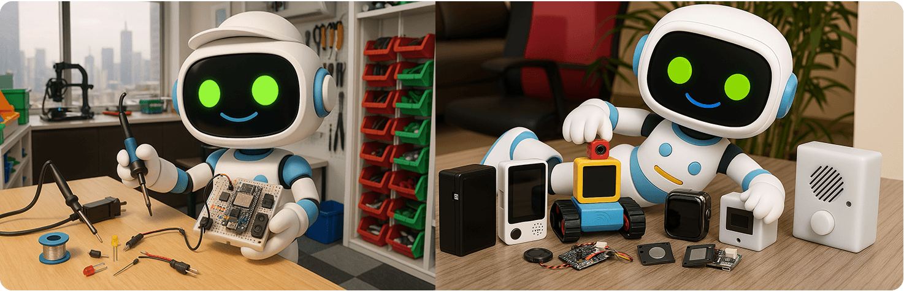

[](https://github.com/xinnan-tech/xiaozhi-esp32-server)

<h1 align="center">Xiaozhi Backend Service xiaozhi-esp32-server</h1>

<p align="center">
This project provides backend services for the open-source smart hardware project
<a href="https://github.com/78/xiaozhi-esp32">xiaozhi-esp32</a><br/>
Implemented using Python, Java, and Vue according to the <a href="https://ccnphfhqs21z.feishu.cn/wiki/M0XiwldO9iJwHikpXD5cEx71nKh">Xiaozhi Communication Protocol</a><br/>
Helping you quickly set up your Xiaozhi server
</p>

<p align="center">
<a href="./README.md">中文</a>
· <a href="./docs/FAQ.md">FAQ</a>
· <a href="https://github.com/xinnan-tech/xiaozhi-esp32-server/issues">Report Issues</a>
· <a href="./README_ed.md#deployment-documentation">Deployment Guide</a>
· <a href="https://github.com/xinnan-tech/xiaozhi-esp32-server/releases">Release Notes</a>
</p>
<p align="center">
  <a href="https://github.com/xinnan-tech/xiaozhi-esp32-server/releases">
    
  </a>
  <a href="https://github.com/xinnan-tech/xiaozhi-esp32-server/graphs/contributors">
    
  </a>
  <a href="https://github.com/xinnan-tech/xiaozhi-esp32-server/issues">
    
  </a>
  <a href="https://github.com/xinnan-tech/xiaozhi-esp32-server/pulls">
    
  </a>
  <a href="https://github.com/xinnan-tech/xiaozhi-esp32-server/blob/main/LICENSE">
    
  </a>
  <a href="https://github.com/xinnan-tech/xiaozhi-esp32-server">
    
  </a>
</p>

---

## Target Users 👥

This project requires ESP32 hardware devices. If you have purchased ESP32-related hardware, successfully connected to Brother Xia's backend service, and want to set up your own `xiaozhi-esp32` backend service, then this project is perfect for you.

Want to see it in action? Check out these videos 🎥

<table>
  <tr>
    <td>
        <a href="https://www.bilibili.com/video/BV1FMFyejExX" target="_blank">
         <picture>
           
         </picture>
        </a>
    </td>
    <td>
        <a href="https://www.bilibili.com/video/BV1CDKWemEU6" target="_blank">
         <picture>
           
         </picture>
        </a>
    </td>
    <td>
        <a href="https://www.bilibili.com/video/BV12yA2egEaC" target="_blank">
         <picture>
           
         </picture>
        </a>
    </td>
    <td>
        <a href="https://www.bilibili.com/video/BV1pNXWYGEx1" target="_blank">
         <picture>
           
         </picture>
        </a>
    </td>
    <td>
        <a href="https://www.bilibili.com/video/BV1kgA2eYEQ9" target="_blank">
         <picture>
           
         </picture>
        </a>
    </td>
  </tr>
  <tr>
    <td>
        <a href="https://www.bilibili.com/video/BV1Vy96YCE3R" target="_blank">
         <picture>
           
         </picture>
        </a>
    </td>
    <td>
        <a href="https://www.bilibili.com/video/BV1VC96Y5EMH" target="_blank">
         <picture>
           
         </picture>
        </a>
    </td>
    <td>
        <a href="https://www.bilibili.com/video/BV1Z8XuYZEAS" target="_blank">
         <picture>
           
         </picture>
        </a>
    </td>
    <td>
        <a href="https://www.bilibili.com/video/BV178XuYfEpi" target="_blank">
         <picture>
           
         </picture>
        </a>
    </td>
    <td>
        <a href="https://www.bilibili.com/video/BV17LXWYvENb" target="_blank">
         <picture>
           
         </picture>
        </a>
    </td>
  </tr>
</table>

---

## Warning ⚠️

1. This project is open-source software. This software has no commercial relationship with any third-party API service providers (including but not limited to speech recognition, large models, speech synthesis, and other platforms) and does not provide any form of guarantee for their service quality or financial security.
It is recommended that users prioritize service providers with relevant business licenses and carefully read their service agreements and privacy policies. This software does not host any account keys, does not participate in fund transfers, and does not bear the risk of recharge fund losses.

2. This project's functionality is not complete and has not passed network security testing. Please do not use it in production environments. If you deploy this project for learning in a public network environment, please ensure necessary protection measures are in place.

---

## Deployment Documentation



This project offers two deployment methods. Please choose based on your specific needs:

#### 🚀 Deployment Method Selection

| Deployment Method | Features | Use Case | Docker Deployment Guide | Source Code Deployment Guide |
|---------|------|---------|---------|---------|
| **Simplified Installation** | Smart dialogue, IOT functionality, data stored in configuration files | Low-configuration environment, no database required | [Docker Server Only](./docs/Deployment.md#%E6%96%B9%E5%BC%8F%E4%B8%80docker%E5%8F%AA%E8%BF%90%E8%A1%8Cserver) | [Local Source Code Server Only](./docs/Deployment.md#%E6%96%B9%E5%BC%8F%E4%BA%8C%E6%9C%AC%E5%9C%B0%E6%BA%90%E7%A0%81%E5%8F%AA%E8%BF%90%E8%A1%8Cserver)|
| **Full Module Installation** | Smart dialogue, IOT, OTA, Control Panel, data stored in database | Complete functionality experience |[Docker Full Module](./docs/Deployment_all.md#%E6%96%B9%E5%BC%8F%E4%B8%80docker%E8%BF%90%E8%A1%8C%E5%85%A8%E6%A8%A1%E5%9D%97) | [Local Source Code Full Module](./docs/Deployment_all.md#%E6%96%B9%E5%BC%8F%E4%BA%8C%E6%9C%AC%E5%9C%B0%E6%BA%90%E7%A0%81%E8%BF%90%E8%A1%8C%E5%85%A8%E6%A8%A1%E5%9D%97) |

> 💡 Note: Below is the test platform deployed with the latest code. You can flash and test if needed. Concurrent users: 6, data cleared daily

```
Control Panel: https://2662r3426b.vicp.fun

Service Test Tool: https://2662r3426b.vicp.fun/test/
OTA Interface: https://2662r3426b.vicp.fun/xiaozhi/ota/
Websocket Interface: wss://2662r3426b.vicp.fun/xiaozhi/v1/
```

---
## Feature List ✨

### Implemented ✅

| Feature Module | Description |
|---------|------|
| Communication Protocol | Based on `xiaozhi-esp32` protocol, implements data interaction through WebSocket |
| Dialogue Interaction | Supports wake-up dialogue, manual dialogue, and real-time interruption. Auto-sleep after long periods of inactivity |
| Intent Recognition | Supports LLM intent recognition, function call, reducing hard-coded intent judgment |
| Multi-language Recognition | Supports Mandarin, Cantonese, English, Japanese, Korean (default using FunASR) |
| LLM Module | Supports flexible LLM module switching, default using ChatGLMLLM, also supports Ali Bailing, DeepSeek, Ollama, etc. |
| TTS Module | Supports EdgeTTS (default), Volcano Engine Doubao TTS, and other TTS interfaces for speech synthesis |
| Memory Function | Supports ultra-long memory, local summary memory, and no memory modes for different scenarios |
| IOT Function | Supports managing registered device IOT functionality, intelligent IoT control based on dialogue context |
| Control Panel | Provides web management interface, supports agent management, user management, system configuration, etc. |

### In Development 🚧

To learn about specific development progress, [click here](https://github.com/users/xinnan-tech/projects/3)

If you're a software developer, here's an [Open Letter to Developers](docs/contributor_open_letter.md). Welcome to join!

---

## Product Ecosystem 👬
Xiaozhi is an ecosystem. When using this product, you might want to check out other excellent projects in this ecosystem:

| Project Name | Project Link | Description |
|:---------------------|:--------|:--------|
| Xiaozhi Android Client | [xiaozhi-android-client](https://github.com/TOM88812/xiaozhi-android-client) | A Flutter-based Android and iOS voice dialogue application supporting real-time voice interaction and text dialogue |
| Xiaozhi PC Client | [py-xiaozhi](https://github.com/Huang-junsen/py-xiaozhi) | A Python-based AI client that allows you to experience Xiaozhi AI functionality through code without physical hardware |
| Xiaozhi Java Server | [xiaozhi-esp32-server-java](https://github.com/joey-zhou/xiaozhi-esp32-server-java) | A Java-based open-source project providing complete backend service solutions |

---

## Supported Platforms/Components 📋

### LLM Language Models

| Usage Method | Supported Platforms | Free Platforms |
|:---:|:---:|:---:|
| openai API | Ali Bailing, Volcano Engine Doubao, DeepSeek, ChatGLM, Gemini | ChatGLM, Gemini |
| ollama API | Ollama | - |
| dify API | Dify | - |
| fastgpt API | Fastgpt | - |
| coze API | Coze | - |

Actually, any LLM supporting openai API calls can be integrated.

---

### TTS Speech Synthesis

| Usage Method | Supported Platforms | Free Platforms |
|:---:|:---:|:---:|
| API Calls | EdgeTTS, Volcano Engine Doubao TTS, Tencent Cloud, Aliyun TTS, CosyVoiceSiliconflow, TTS302AI, CozeCnTTS, GizwitsTTS, ACGNTTS, OpenAITTS | EdgeTTS, CosyVoiceSiliconflow(partial) |
| Local Service | FishSpeech, GPT_SOVITS_V2, GPT_SOVITS_V3, MinimaxTTS | FishSpeech, GPT_SOVITS_V2, GPT_SOVITS_V3, MinimaxTTS |

---

### VAD Voice Activity Detection

| Type | Platform Name | Usage Method | Pricing | Notes |
|:---:|:---------:|:----:|:----:|:--:|
| VAD | SileroVAD | Local Use | Free | |

---

### ASR Speech Recognition

| Usage Method | Supported Platforms | Free Platforms |
|:---:|:---:|:---:|
| Local Use | FunASR, SherpaASR | FunASR, SherpaASR |
| API Calls | DoubaoASR, FunASRServer, TencentASR, AliyunASR | FunASRServer |

---

### Memory Storage

| Type | Platform Name | Usage Method | Pricing | Notes |
|:------:|:---------------:|:----:|:---------:|:--:|
| Memory | mem0ai | API Calls | 1000 calls/month quota | |
| Memory | mem_local_short | Local Summary | Free | |

---

### Intent Recognition

| Type | Platform Name | Usage Method | Pricing | Notes |
|:------:|:-------------:|:----:|:-------:|:---------------------:|
| Intent | intent_llm | API Calls | Based on LLM pricing | Uses large model for intent recognition, highly versatile |
| Intent | function_call | API Calls | Based on LLM pricing | Uses large model function calls for intent, fast and effective |

---

## Acknowledgments 🙏

| Logo | Project/Company | Description |
|:---:|:---:|:---|
|  | [Bailing Voice Dialogue Robot](https://github.com/wwbin2017/bailing) | This project was inspired by [Bailing Voice Dialogue Robot](https://github.com/wwbin2017/bailing) and implemented based on it |
|  | [Tenclass](https://www.tenclass.com/) | Thanks to [Tenclass](https://www.tenclass.com/) for developing standard communication protocols, multi-device compatibility solutions, and high-concurrency scenario practices for the Xiaozhi ecosystem; providing comprehensive technical documentation support for this project |
|  | [Xuanfeng Technology](https://github.com/Eric0308) | Thanks to [Xuanfeng Technology](https://github.com/Eric0308) for contributing function call framework, MCP communication protocol, and plugin call mechanism implementation code, significantly improving front-end device (IoT) interaction efficiency and functional extensibility through standardized instruction scheduling system and dynamic expansion capabilities |
|  | [Huiyuan Design](http://ui.kwd988.net/) | Thanks to [Huiyuan Design](http://ui.kwd988.net/) for providing professional visual solutions for this project, empowering product user experience with their design experience serving over a thousand enterprises |
|  | [Xi'an Qinren Information Technology](https://www.029app.com/) | Thanks to [Xi'an Qinren Information Technology](https://www.029app.com/) for deepening this project's visual system, ensuring consistency and extensibility of overall design style in multi-scenario applications |


<a href="https://star-history.com/#xinnan-tech/xiaozhi-esp32-server&Date">

 <picture>
   <source media="(prefers-color-scheme: dark)" srcset="https://api.star-history.com/svg?repos=xinnan-tech/xiaozhi-esp32-server&type=Date&theme=dark" />
   <source media="(prefers-color-scheme: light)" srcset="https://api.star-history.com/svg?repos=xinnan-tech/xiaozhi-esp32-server&type=Date" />
   
 </picture>
</a> 