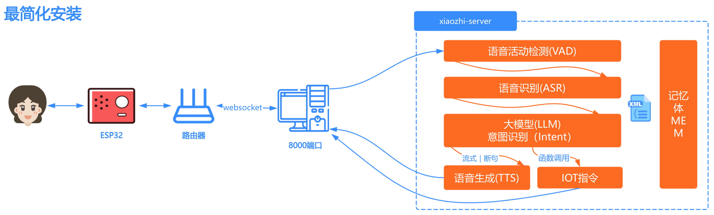

# 部署架构图

# 方式一：Docker只运行Server

docker镜像已支持x86架构、arm64架构的CPU，支持在国产操作系统上运行。

## 1. 安装docker

如果您的电脑还没安装docker，可以按照这里的教程安装：[docker安装](https://www.runoob.com/docker/ubuntu-docker-install.html)

如果你已经安装好docker，你可以[1.1使用懒人脚本](#11-懒人脚本)自动帮你下载所需的文件和配置文件，你可以使用docker[1.2手动部署](#12-手动部署)。

### 1.1 懒人脚本

你可以使用以下命令一键下载并执行部署脚本：
请确保你的环境可以正常访问 GitHub 否则无法下载脚本。
```bash
curl -L -o docker-setup.sh https://raw.githubusercontent.com/xinnan-tech/xiaozhi-esp32-server/main/docker-setup.sh
```

如果您的电脑是windows系统，请使用使用 Git Bash、WSL、PowerShell 或 CMD 运行以下命令：
```bash
# Git Bash 或 WSL
sh docker-setup.sh
# PowerShell 或 CMD
.\docker-setup.sh
```

如果您的电脑是linux 或者 macos 系统，请使用终端运行以下命令：
```bash
chmod +x docker-setup.sh
./docker-setup.sh
```

脚本会自动完成以下操作：
> 1. 创建必要的目录结构
> 2. 下载语音识别模型
> 3. 下载配置文件
> 4. 检查文件完整性
>
> 执行完成后，请按照提示配置 API 密钥。

当你一切顺利完成以上操作后，继续操作[配置项目文件](#2-配置项目文件)

### 1.2 手动部署

如果懒人脚本无法正常运行，请按本章节1.2进行手动部署。

#### 1.2.1 创建目录

安装完后，你需要为这个项目找一个安放配置文件的目录，例如我们可以新建一个文件夹叫`xiaozhi-server`。

创建好目录后，你需要在`xiaozhi-server`下面创建`data`文件夹和`models`文件夹，`models`下面还要再创建`SenseVoiceSmall`文件夹。

最终目录结构如下所示：

```
xiaozhi-server
  ├─ data
  ├─ models
     ├─ SenseVoiceSmall
```

#### 1.2.2 下载语音识别模型文件

你需要下载语音识别的模型文件，因为本项目的默认语音识别用的是本地离线语音识别方案。可通过这个方式下载
[跳转到下载语音识别模型文件](#模型文件)

下载完后，回到本教程。

#### 1.2.3 下载配置文件

你需要下载两个配置文件：`docker-compose.yaml` 和 `config.yaml`。需要从项目仓库下载这两个文件。

##### 1.2.3.1 下载 docker-compose.yaml

用浏览器打开[这个链接](../main/xiaozhi-server/docker-compose.yml)。

在页面的右侧找到名称为`RAW`按钮，在`RAW`按钮的旁边，找到下载的图标，点击下载按钮，下载`docker-compose.yml`文件。 把文件下载到你的
`xiaozhi-server`中。

下载完后，回到本教程继续往下。

##### 1.2.3.2 下载 config.yaml

用浏览器打开[这个链接](../main/xiaozhi-server/config.yaml)。

在页面的右侧找到名称为`RAW`按钮，在`RAW`按钮的旁边，找到下载的图标，点击下载按钮，下载`config.yaml`文件。 把文件下载到你的
`xiaozhi-server`下面的`data`文件夹中，然后把`config.yaml`文件重命名为`.config.yaml`。

下载完配置文件后，我们确认一下整个`xiaozhi-server`里面的文件如下所示：

```
xiaozhi-server
  ├─ docker-compose.yml
  ├─ data
    ├─ .config.yaml
  ├─ models
     ├─ SenseVoiceSmall
       ├─ model.pt
```

如果你的文件目录结构也是上面的，就继续往下。如果不是，你就再仔细看看是不是漏操作了什么。

## 2. 配置项目文件

接下里，程序还不能直接运行，你需要配置一下，你到底使用的是什么模型。你可以看这个教程：
[跳转到配置项目文件](#配置项目)

配置完项目文件后，回到本教程继续往下。

## 3. 执行docker命令

打开命令行工具，使用`终端`或`命令行`工具 进入到你的`xiaozhi-server`，执行以下命令

```
docker-compose up -d
```

执行完后，再执行以下命令，查看日志信息。

```
docker logs -f xiaozhi-esp32-server
```

这时，你就要留意日志信息，可以根据这个教程，判断是否成功了。[跳转到运行状态确认](#运行状态确认)

## 5. 版本升级操作

如果后期想升级版本，可以这么操作

5.1、备份好`data`文件夹中的`.config.yaml`文件，一些关键的配置到时复制到新的`.config.yaml`文件里。
请注意是对关键密钥逐个复制，不要直接覆盖。因为新的`.config.yaml`文件可能有一些新的配置项，旧的`.config.yaml`文件不一定有。

5.2、执行以下命令

```
docker stop xiaozhi-esp32-server
docker rm xiaozhi-esp32-server
docker stop xiaozhi-esp32-server-web
docker rm xiaozhi-esp32-server-web
docker rmi ghcr.nju.edu.cn/xinnan-tech/xiaozhi-esp32-server:server_latest
docker rmi ghcr.nju.edu.cn/xinnan-tech/xiaozhi-esp32-server:web_latest
```

5.3、重新按docker方式部署

# 方式二：本地源码只运行Server

## 1.安装基础环境

本项目使用`conda`管理依赖环境。如果不方便安装`conda`，需要根据实际的操作系统安装好`libopus`和`ffmpeg`。
如果确定使用`conda`，则安装好后，开始执行以下命令。

重要提示！windows 用户，可以通过安装`Anaconda`来管理环境。安装好`Anaconda`后，在`开始`那里搜索`anaconda`相关的关键词，
找到`Anaconda Prpmpt`，使用管理员身份运行它。如下图。


运行之后，如果你能看到命令行窗口前面有一个(base)字样，说明你成功进入了`conda`环境。那么你就可以执行以下命令了。


```
conda remove -n xiaozhi-esp32-server --all -y
conda create -n xiaozhi-esp32-server python=3.10 -y
conda activate xiaozhi-esp32-server

# 添加清华源通道
conda config --add channels https://mirrors.tuna.tsinghua.edu.cn/anaconda/pkgs/main
conda config --add channels https://mirrors.tuna.tsinghua.edu.cn/anaconda/pkgs/free
conda config --add channels https://mirrors.tuna.tsinghua.edu.cn/anaconda/cloud/conda-forge

conda install libopus -y
conda install ffmpeg -y
```

请注意，以上命令，不是一股脑执行就成功的，你需要一步步执行，每一步执行完后，都检查一下输出的日志，查看是否成功。

## 2.安装本项目依赖

你先要下载本项目源码，源码可以通过`git clone`命令下载，如果你不熟悉`git clone`命令。

你可以用浏览器打开这个地址`https://github.com/xinnan-tech/xiaozhi-esp32-server.git`

打开完，找到页面中一个绿色的按钮，写着`Code`的按钮，点开它，然后你就看到`Download ZIP`的按钮。

点击它，下载本项目源码压缩包。下载到你电脑后，解压它，此时它的名字可能叫`xiaozhi-esp32-server-main`
你需要把它重命名成`xiaozhi-esp32-server`，在这个文件里，进入到`main`文件夹，再进入到`xiaozhi-server`，好了请记住这个目录`xiaozhi-server`。

```
# 继续使用conda环境
conda activate xiaozhi-esp32-server
# 进入到你的项目根目录，再进入main/xiaozhi-server
cd main/xiaozhi-server
pip config set global.index-url https://mirrors.aliyun.com/pypi/simple/
pip install -r requirements.txt
```

## 3.下载语音识别模型文件

你需要下载语音识别的模型文件，因为本项目的默认语音识别用的是本地离线语音识别方案。可通过这个方式下载
[跳转到下载语音识别模型文件](#模型文件)

下载完后，回到本教程。

## 4.配置项目文件

接下来，程序还不能直接运行，你需要配置一下，你到底使用的是什么模型。你可以看这个教程：
[跳转到配置项目文件](#配置项目)

## 5.运行项目

```
# 确保在xiaozhi-server目录下执行
conda activate xiaozhi-esp32-server
python app.py
```
这时，你就要留意日志信息，可以根据这个教程，判断是否成功了。[跳转到运行状态确认](#运行状态确认)


# 汇总

## 配置项目

如果你的`xiaozhi-server`目录没有`data`，你需要创建`data`目录。
如果你的`data`下面没有`.config.yaml`文件，你可以把`xiaozhi-server`目录下的`config.yaml`文件复制到`data`，并重命名为`.config.yaml`

修改`xiaozhi-server`下`data`目录下的`.config.yaml`文件，配置本项目必须的一个配置。

- 默认的LLM使用的是`ChatGLMLLM`，你需要配置密钥，因为他们的模型，虽然有免费的，但是仍要去[官网](https://bigmodel.cn/usercenter/proj-mgmt/apikeys)注册密钥，才能启动。

配置说明：这里是各个功能使用的默认组件，例如LLM默认使用`ChatGLMLLM`模型。如果需要切换模型，就是改对应的名称。
本项目的默认配置仅是成本最低配置（`glm-4-flash`和`EdgeTTS`都是免费的），如果需要更优的更快的搭配，需要自己结合部署环境切换各组件的使用。

```
selected_module:
  VAD: SileroVAD
  ASR: FunASR
  LLM: ChatGLMLLM
  TTS: EdgeTTS
  # 默认不开启记忆，如需开启请看配置文件里的描述
  Memory: nomem
  # 默认不开启意图识别，如需开启请看配置文件里的描述
  Intent: nointent
```

比如修改`LLM`使用的组件，就看本项目支持哪些`LLM` API接口，当前支持的是`openai`、`dify`。欢迎验证和支持更多LLM平台的接口。
使用时，在`selected_module`修改成对应的如下LLM配置的名称：

```
LLM:
  DeepSeekLLM:
    type: openai
    ...
  ChatGLMLLM:
    type: openai
    ...
  DifyLLM:
    type: dify
    ...
```

## 模型文件

本项目语音识别模型，默认使用`SenseVoiceSmall`模型，进行语音转文字。因为模型较大，需要独立下载，下载后把`model.pt`
文件放在`models/SenseVoiceSmall`
目录下。下面两个下载路线任选一个。

- 线路一：阿里魔塔下载[SenseVoiceSmall](https://modelscope.cn/models/iic/SenseVoiceSmall/resolve/master/model.pt)
- 线路二：百度网盘下载[SenseVoiceSmall](https://pan.baidu.com/share/init?surl=QlgM58FHhYv1tFnUT_A8Sg&pwd=qvna) 提取码:
  `qvna`

## 运行状态确认

如果你能看到，类似以下日志,则是本项目服务启动成功的标志。

```
250427 13:04:20[0.3.11_SiFuChTTnofu][__main__]-INFO-OTA接口是           http://192.168.4.123:8002/xiaozhi/ota/
250427 13:04:20[0.3.11_SiFuChTTnofu][__main__]-INFO-Websocket地址是     ws://192.168.4.123:8000/xiaozhi/v1/
250427 13:04:20[0.3.11_SiFuChTTnofu][__main__]-INFO-=======上面的地址是websocket协议地址，请勿用浏览器访问=======
250427 13:04:20[0.3.11_SiFuChTTnofu][__main__]-INFO-如想测试websocket请用谷歌浏览器打开test目录下的test_page.html
250427 13:04:20[0.3.11_SiFuChTTnofu][__main__]-INFO-=======================================================
```

正常来说，如果您是通过源码运行本项目，日志会有你的接口地址信息。
但是如果你用docker部署，那么你的日志里给出的接口地址信息就不是真实的接口地址。

最正确的方法，是根据电脑的局域网IP来确定你的接口地址。
如果你的电脑的局域网IP比如是`192.168.1.25`，那么你的接口地址就是：`ws://192.168.1.25:8000/xiaozhi/v1/`，对应的OTA地址就是：`http://192.168.1.25:8002/xiaozhi/ota/`。

这个信息很有用的，后面`编译esp32固件`需要用到。

接下来，你就可以开始操作你的esp32设备了，你可以`自行编译esp32固件`也可以配置使用`虾哥编译好的1.6.1以上版本的固件`。两个任选一个

1、 [编译自己的esp32固件](firmware-build.md)了。

2、 [基于虾哥编译好的固件配置自定义服务器](firmware-setting.md)了。


以下是一些常见问题，供参考：

[1、为什么我说的话，小智识别出来很多韩文、日文、英文](./FAQ.md)

[2、为什么会出现“TTS 任务出错 文件不存在”？](./FAQ.md)

[3、TTS 经常失败，经常超时](./FAQ.md)

[4、使用Wifi能连接自建服务器，但是4G模式却接不上](./FAQ.md)

[5、如何提高小智对话响应速度？](./FAQ.md)

[6、我说话很慢，停顿时小智老是抢话](./FAQ.md)

[7、我想通过小智控制电灯、空调、远程开关机等操作](./FAQ.md)
