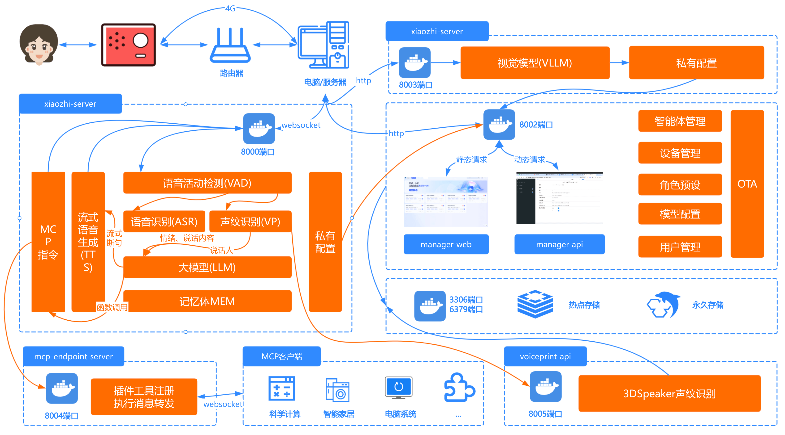

# 部署架构图

# 方式一：Docker运行全模块
docker镜像已支持x86架构、arm64架构的CPU，支持在国产操作系统上运行。

## 1. 安装docker

如果您的电脑还没安装docker，可以按照这里的教程安装：[docker安装](https://www.runoob.com/docker/ubuntu-docker-install.html)

docker 安装全模块有两种方式，你可以[使用懒人脚本](./Deployment_all.md#11-懒人脚本)（作者[@VanillaNahida](https://github.com/VanillaNahida)）  
脚本会自动帮你下载所需的文件和配置文件，你也可以使用[手动部署](./Deployment_all.md#12-手动部署)从零搭建。


### 1.1 懒人脚本
部署简便，可以参考[视频教程](https://www.bilibili.com/video/BV17bbvzHExd/) ，文字版教程如下：
> [!NOTE]  
> 暂且只支持Ubuntu服务器一键部署，其他系统未尝试，可能会有一些奇怪的bug

使用SSH工具连接到服务器，以root权限执行如下脚本
```bash
sudo bash -c "$(wget -qO- https://ghfast.top/https://raw.githubusercontent.com/xinnan-tech/xiaozhi-esp32-server/main/docker-setup.sh)"
```

脚本会自动完成以下操作：
> 1. 安装Docker
> 2. 配置镜像源
> 3. 下载/拉取镜像
> 4. 下载语音识别模型文件
> 5. 引导配置服务端
>

执行完成后简单配置后，再参照[4. 运行程序](#4. 运行程序)和[5.重启xiaozhi-esp32-server](#5.重启xiaozhi-esp32-server)里提到的最重要的3件事情，完成3这三项配置后即可使用。

### 1.2 手动部署

#### 1.2.1 创建目录

安装完后，你需要为这个项目找一个安放配置文件的目录，例如我们可以新建一个文件夹叫`xiaozhi-server`。

创建好目录后，你需要在`xiaozhi-server`下面创建`data`文件夹和`models`文件夹，`models`下面还要再创建`SenseVoiceSmall`文件夹。

最终目录结构如下所示：

```
xiaozhi-server
  ├─ data
  ├─ models
     ├─ SenseVoiceSmall
```

#### 1.2.2 下载语音识别模型文件

本项目语音识别模型，默认使用`SenseVoiceSmall`模型，进行语音转文字。因为模型较大，需要独立下载，下载后把`model.pt`
文件放在`models/SenseVoiceSmall`
目录下。下面两个下载路线任选一个。

- 线路一：阿里魔搭下载[SenseVoiceSmall](https://modelscope.cn/models/iic/SenseVoiceSmall/resolve/master/model.pt)
- 线路二：百度网盘下载[SenseVoiceSmall](https://pan.baidu.com/share/init?surl=QlgM58FHhYv1tFnUT_A8Sg&pwd=qvna) 提取码:
  `qvna`


#### 1.2.3 下载配置文件

你需要下载两个配置文件：`docker-compose_all.yaml` 和 `config_from_api.yaml`。需要从项目仓库下载这两个文件。

##### 1.2.3.1 下载 docker-compose_all.yaml

用浏览器打开[这个链接](../main/xiaozhi-server/docker-compose_all.yml)。

在页面的右侧找到名称为`RAW`按钮，在`RAW`按钮的旁边，找到下载的图标，点击下载按钮，下载`docker-compose_all.yml`文件。 把文件下载到你的
`xiaozhi-server`中。

或者直接执行 `wget https://raw.githubusercontent.com/xinnan-tech/xiaozhi-esp32-server/refs/heads/main/main/xiaozhi-server/docker-compose_all.yml` 下载。

下载完后，回到本教程继续往下。

##### 1.2.3.2 下载 config_from_api.yaml

用浏览器打开[这个链接](../main/xiaozhi-server/config_from_api.yaml)。

在页面的右侧找到名称为`RAW`按钮，在`RAW`按钮的旁边，找到下载的图标，点击下载按钮，下载`config_from_api.yaml`文件。 把文件下载到你的
`xiaozhi-server`下面的`data`文件夹中，然后把`config_from_api.yaml`文件重命名为`.config.yaml`。

或者直接执行 `wget https://raw.githubusercontent.com/xinnan-tech/xiaozhi-esp32-server/refs/heads/main/main/xiaozhi-server/config_from_api.yaml` 下载保存。

下载完配置文件后，我们确认一下整个`xiaozhi-server`里面的文件如下所示：

```
xiaozhi-server
  ├─ docker-compose_all.yml
  ├─ data
    ├─ .config.yaml
  ├─ models
     ├─ SenseVoiceSmall
       ├─ model.pt
```

如果你的文件目录结构也是上面的，就继续往下。如果不是，你就再仔细看看是不是漏操作了什么。

## 2. 备份数据

如果你之前已经成功运行智控台，如果上面保存有你的密钥信息，请先从智控台上拷贝重要数据下来。因为升级过程中，有可能会覆盖原来的数据。

## 3. 清除历史版本镜像和容器
接下来打开命令行工具，使用`终端`或`命令行`工具 进入到你的`xiaozhi-server`，执行以下命令

```
docker compose -f docker-compose_all.yml down

docker stop xiaozhi-esp32-server
docker rm xiaozhi-esp32-server

docker stop xiaozhi-esp32-server-web
docker rm xiaozhi-esp32-server-web

docker stop xiaozhi-esp32-server-db
docker rm xiaozhi-esp32-server-db

docker stop xiaozhi-esp32-server-redis
docker rm xiaozhi-esp32-server-redis

docker rmi ghcr.nju.edu.cn/xinnan-tech/xiaozhi-esp32-server:server_latest
docker rmi ghcr.nju.edu.cn/xinnan-tech/xiaozhi-esp32-server:web_latest
```

## 4. 运行程序
执行以下命令启动新版本容器

```
docker compose -f docker-compose_all.yml up -d
```

执行完后，再执行以下命令，查看日志信息。

```
docker logs -f xiaozhi-esp32-server-web
```

当你看到输出日志时，说明你的`智控台`启动成功了。

```
2025-xx-xx 22:11:12.445 [main] INFO  c.a.d.s.b.a.DruidDataSourceAutoConfigure - Init DruidDataSource
2025-xx-xx 21:28:53.873 [main] INFO  xiaozhi.AdminApplication - Started AdminApplication in 16.057 seconds (process running for 17.941)
http://localhost:8002/xiaozhi/doc.html
```

请注意此刻仅是`智控台`能运行，如果8000端口`xiaozhi-esp32-server`报错，先不要理会。

这时，你需要使用浏览器，打开`智控台`，链接：http://127.0.0.1:8002 ，注册第一个用户。第一个用户即是超级管理员，以后的用户都是普通用户。普通用户只能绑定设备和配置智能体;超级管理员可以进行模型管理、用户管理、参数配置等功能。

接下来要做三件重要的事情：

### 第一件重要的事情

使用超级管理员账号，登录智控台，在顶部菜单找到`参数管理`，找到列表中第一条数据，参数编码是`server.secret`，复制它到`参数值`。

`server.secret`需要说明一下，这个`参数值`很重要，作用是让我们的`Server`端连接`manager-api`。`server.secret`是每次从零部署manager模块时，会自动随机生成的密钥。

复制`参数值`后，打开`xiaozhi-server`下的`data`目录的`.config.yaml`文件。此刻你的配置文件内容应该是这样的：

```
manager-api:
  url:  http://127.0.0.1:8002/xiaozhi
  secret: 你的server.secret值
```
1、把你刚才从`智控台`复制过来的`server.secret`的`参数值`复制到`.config.yaml`文件里的`secret`里。

2、因为你是docker部署，把`url`改成下面的`http://xiaozhi-esp32-server-web:8002/xiaozhi`

3、因为你是docker部署，把`url`改成下面的`http://xiaozhi-esp32-server-web:8002/xiaozhi`

4、因为你是docker部署，把`url`改成下面的`http://xiaozhi-esp32-server-web:8002/xiaozhi`

类似这样的效果
```
manager-api:
  url: http://xiaozhi-esp32-server-web:8002/xiaozhi
  secret: 12345678-xxxx-xxxx-xxxx-123456789000
```

保存好后，继续往下做第二件重要的事情

### 第二件重要的事情

使用超级管理员账号，登录智控台，在顶部菜单找到`模型配置`，然后在左侧栏点击`大语言模型`，找到第一条数据`智谱AI`，点击`修改`按钮，
弹出修改框后，将你注册到的`智谱AI`的密钥填写到`API密钥`中。然后点击保存。

## 5.重启xiaozhi-esp32-server

接下来打开命令行工具，使用`终端`或`命令行`工具 输入
```
docker restart xiaozhi-esp32-server
docker logs -f xiaozhi-esp32-server
```
如果你能看到，类似以下日志,则是Server启动成功的标志。

```
25-02-23 12:01:09[core.websocket_server] - INFO - Websocket地址是      ws://xxx.xx.xx.xx:8000/xiaozhi/v1/
25-02-23 12:01:09[core.websocket_server] - INFO - =======上面的地址是websocket协议地址，请勿用浏览器访问=======
25-02-23 12:01:09[core.websocket_server] - INFO - 如想测试websocket请用谷歌浏览器打开test目录下的test_page.html
25-02-23 12:01:09[core.websocket_server] - INFO - =======================================================
```

由于你是全模块部署，因此你有两个重要的接口需要写入到esp32中。

OTA接口：
```
http://你宿主机局域网的ip:8002/xiaozhi/ota/
```

Websocket接口：
```
ws://你宿主机的ip:8000/xiaozhi/v1/
```

### 第三件重要的事情

使用超级管理员账号，登录智控台，在顶部菜单找到`参数管理`，找到参数编码是`server.websocket`，输入你的`Websocket接口`。

使用超级管理员账号，登录智控台，在顶部菜单找到`参数管理`，找到数编码是`server.ota`，输入你的`OTA接口`。

接下来，你就可以开始操作你的esp32设备了，你可以`自行编译esp32固件`也可以配置使用`虾哥编译好的1.6.1以上版本的固件`。两个任选一个

1、 [编译自己的esp32固件](firmware-build.md)了。

2、 [基于虾哥编译好的固件配置自定义服务器](firmware-setting.md)了。


# 方式二：本地源码运行全模块

## 1.安装MySQL数据库

如果本机已经安装了MySQL，可以直接在数据库中创建名为`xiaozhi_esp32_server`的数据库。

```sql
CREATE DATABASE xiaozhi_esp32_server CHARACTER SET utf8mb4 COLLATE utf8mb4_unicode_ci;
```

如果还没有MySQL，你可以通过docker安装mysql

```
docker run --name xiaozhi-esp32-server-db -e MYSQL_ROOT_PASSWORD=123456 -p 3306:3306 -e MYSQL_DATABASE=xiaozhi_esp32_server -e MYSQL_INITDB_ARGS="--character-set-server=utf8mb4 --collation-server=utf8mb4_unicode_ci" -e TZ=Asia/Shanghai -d mysql:latest
```

## 2.安装redis

如果还没有Redis，你可以通过docker安装redis

```
docker run --name xiaozhi-esp32-server-redis -d -p 6379:6379 redis
```

## 3.运行manager-api程序

3.1 安装JDK21，设置JDK环境变量

3.2 安装Maven，设置Maven环境变量

3.3 使用Vscode编程工具，安装好Java环境相关插件

3.4 使用Vscode编程工具加载manager-api模块

在`src/main/resources/application-dev.yml`中配置数据库连接信息

```
spring:
  datasource:
    username: root
    password: 123456
```
在`src/main/resources/application-dev.yml`中配置Redis连接信息
```
spring:
    data:
      redis:
        host: localhost
        port: 6379
        password:
        database: 0
```

3.5 运行主程序

本项目为SpringBoot项目，启动方式为：
打开`Application.java`运行`Main`方法启动

```
路径地址：
src/main/java/xiaozhi/AdminApplication.java
```

当你看到输出日志时，说明你的`manager-api`启动成功了。

```
2025-xx-xx 22:11:12.445 [main] INFO  c.a.d.s.b.a.DruidDataSourceAutoConfigure - Init DruidDataSource
2025-xx-xx 21:28:53.873 [main] INFO  xiaozhi.AdminApplication - Started AdminApplication in 16.057 seconds (process running for 17.941)
http://localhost:8002/xiaozhi/doc.html
```

## 4.运行manager-web程序

4.1 安装nodejs

4.2 使用Vscode编程工具加载manager-web模块

终端命令进入manager-web目录下

```
npm install
```
然后启动
```
npm run serve
```

请注意，如果你的manager-api的接口不在`http://localhost:8002`，请在开发时，修改
`main/manager-web/.env.development`中的路径

运行成功后，你需要使用浏览器，打开`智控台`，链接：http://127.0.0.1:8001 ，注册第一个用户。第一个用户即是超级管理员，以后的用户都是普通用户。普通用户只能绑定设备和配置智能体;超级管理员可以进行模型管理、用户管理、参数配置等功能。


重要：注册成功后，使用超级管理员账号，登录智控台，在顶部菜单找到`模型配置`，然后在左侧栏点击`大语言模型`，找到第一条数据`智谱AI`，点击`修改`按钮，
弹出修改框后，将你注册到的`智谱AI`的密钥填写到`API密钥`中。然后点击保存。

重要：注册成功后，使用超级管理员账号，登录智控台，在顶部菜单找到`模型配置`，然后在左侧栏点击`大语言模型`，找到第一条数据`智谱AI`，点击`修改`按钮，
弹出修改框后，将你注册到的`智谱AI`的密钥填写到`API密钥`中。然后点击保存。

重要：注册成功后，使用超级管理员账号，登录智控台，在顶部菜单找到`模型配置`，然后在左侧栏点击`大语言模型`，找到第一条数据`智谱AI`，点击`修改`按钮，
弹出修改框后，将你注册到的`智谱AI`的密钥填写到`API密钥`中。然后点击保存。

## 5.安装Python环境

本项目使用`conda`管理依赖环境。如果不方便安装`conda`，需要根据实际的操作系统安装好`libopus`和`ffmpeg`。
如果确定使用`conda`，则安装好后，开始执行以下命令。

重要提示！windows 用户，可以通过安装`Anaconda`来管理环境。安装好`Anaconda`后，在`开始`那里搜索`anaconda`相关的关键词，
找到`Anaconda Prpmpt`，使用管理员身份运行它。如下图。


运行之后，如果你能看到命令行窗口前面有一个(base)字样，说明你成功进入了`conda`环境。那么你就可以执行以下命令了。


```
conda remove -n xiaozhi-esp32-server --all -y
conda create -n xiaozhi-esp32-server python=3.10 -y
conda activate xiaozhi-esp32-server

# 添加清华源通道
conda config --add channels https://mirrors.tuna.tsinghua.edu.cn/anaconda/pkgs/main
conda config --add channels https://mirrors.tuna.tsinghua.edu.cn/anaconda/pkgs/free
conda config --add channels https://mirrors.tuna.tsinghua.edu.cn/anaconda/cloud/conda-forge

conda install libopus -y
conda install ffmpeg -y
```

请注意，以上命令，不是一股脑执行就成功的，你需要一步步执行，每一步执行完后，都检查一下输出的日志，查看是否成功。

## 6.安装本项目依赖

你先要下载本项目源码，源码可以通过`git clone`命令下载，如果你不熟悉`git clone`命令。

你可以用浏览器打开这个地址`https://github.com/xinnan-tech/xiaozhi-esp32-server.git`

打开完，找到页面中一个绿色的按钮，写着`Code`的按钮，点开它，然后你就看到`Download ZIP`的按钮。

点击它，下载本项目源码压缩包。下载到你电脑后，解压它，此时它的名字可能叫`xiaozhi-esp32-server-main`
你需要把它重命名成`xiaozhi-esp32-server`，在这个文件里，进入到`main`文件夹，再进入到`xiaozhi-server`，好了请记住这个目录`xiaozhi-server`。

```
# 继续使用conda环境
conda activate xiaozhi-esp32-server
# 进入到你的项目根目录，再进入main/xiaozhi-server
cd main/xiaozhi-server
pip config set global.index-url https://mirrors.aliyun.com/pypi/simple/
pip install -r requirements.txt
```

### 7.下载语音识别模型文件

本项目语音识别模型，默认使用`SenseVoiceSmall`模型，进行语音转文字。因为模型较大，需要独立下载，下载后把`model.pt`
文件放在`models/SenseVoiceSmall`
目录下。下面两个下载路线任选一个。

- 线路一：阿里魔搭下载[SenseVoiceSmall](https://modelscope.cn/models/iic/SenseVoiceSmall/resolve/master/model.pt)
- 线路二：百度网盘下载[SenseVoiceSmall](https://pan.baidu.com/share/init?surl=QlgM58FHhYv1tFnUT_A8Sg&pwd=qvna) 提取码:
  `qvna`

## 8.配置项目文件

使用超级管理员账号，登录智控台 ，在顶部菜单找到`参数管理`，找到列表中第一条数据，参数编码是`server.secret`，复制它到`参数值`。

`server.secret`需要说明一下，这个`参数值`很重要，作用是让我们的`Server`端连接`manager-api`。`server.secret`是每次从零部署manager模块时，会自动随机生成的密钥。

如果你的`xiaozhi-server`目录没有`data`，你需要创建`data`目录。
如果你的`data`下面没有`.config.yaml`文件，你可以把`xiaozhi-server`目录下的`config_from_api.yaml`文件复制到`data`，并重命名为`.config.yaml`

复制`参数值`后，打开`xiaozhi-server`下的`data`目录的`.config.yaml`文件。此刻你的配置文件内容应该是这样的：

```
manager-api:
  url: http://127.0.0.1:8002/xiaozhi
  secret: 你的server.secret值
```

把你刚才从`智控台`复制过来的`server.secret`的`参数值`复制到`.config.yaml`文件里的`secret`里。

类似这样的效果
```
manager-api:
  url: http://127.0.0.1:8002/xiaozhi
  secret: 12345678-xxxx-xxxx-xxxx-123456789000
```

## 5.运行项目

```
# 确保在xiaozhi-server目录下执行
conda activate xiaozhi-esp32-server
python app.py
```

如果你能看到，类似以下日志,则是本项目服务启动成功的标志。

```
25-02-23 12:01:09[core.websocket_server] - INFO - Server is running at ws://xxx.xx.xx.xx:8000/xiaozhi/v1/
25-02-23 12:01:09[core.websocket_server] - INFO - =======上面的地址是websocket协议地址，请勿用浏览器访问=======
25-02-23 12:01:09[core.websocket_server] - INFO - 如想测试websocket请用谷歌浏览器打开test目录下的test_page.html
25-02-23 12:01:09[core.websocket_server] - INFO - =======================================================
```

由于你是全模块部署，因此你有两个重要的接口。

OTA接口：
```
http://你电脑局域网的ip:8002/xiaozhi/ota/
```

Websocket接口：
```
ws://你电脑局域网的ip:8000/xiaozhi/v1/
```

请你务必把以上两个接口地址写入到智控台中：他们将会影响websocket地址发放和自动升级功能。

1、使用超级管理员账号，登录智控台，在顶部菜单找到`参数管理`，找到参数编码是`server.websocket`，输入你的`Websocket接口`。

2、使用超级管理员账号，登录智控台，在顶部菜单找到`参数管理`，找到数编码是`server.ota`，输入你的`OTA接口`。


接下来，你就可以开始操作你的esp32设备了，你可以`自行编译esp32固件`也可以配置使用`虾哥编译好的1.6.1以上版本的固件`。两个任选一个

1、 [编译自己的esp32固件](firmware-build.md)了。

2、 [基于虾哥编译好的固件配置自定义服务器](firmware-setting.md)了。

# 常见问题
以下是一些常见问题，供参考：

1、[为什么我说的话，小智识别出来很多韩文、日文、英文](./FAQ.md)<br/>
2、[为什么会出现“TTS 任务出错 文件不存在”？](./FAQ.md)<br/>
3、[TTS 经常失败，经常超时](./FAQ.md)<br/>
4、[使用Wifi能连接自建服务器，但是4G模式却接不上](./FAQ.md)<br/>
5、[如何提高小智对话响应速度？](./FAQ.md)<br/>
6、[我说话很慢，停顿时小智老是抢话](./FAQ.md)<br/>
## 部署相关教程
1、[如何自动拉取本项目最新代码自动编译和启动](./dev-ops-integration.md)<br/>
2、[如何与Nginx集成](https://github.com/xinnan-tech/xiaozhi-esp32-server/issues/791)<br/>
## 拓展相关教程
1、[如何开启手机号码注册智控台](./ali-sms-integration.md)<br/>
2、[如何集成HomeAssistant实现智能家居控制](./homeassistant-integration.md)<br/>
3、[如何开启视觉模型实现拍照识物](./mcp-vision-integration.md)<br/>
4、[如何部署MCP接入点](./mcp-endpoint-enable.md)<br/>
5、[如何接入MCP接入点](./mcp-endpoint-integration.md)<br/>
6、[如何开启声纹识别](./voiceprint-integration.md)<br/>
10、[新闻插件源配置指南](./newsnow_plugin_config.md)<br/>
## 语音克隆、本地语音部署相关教程
1、[如何部署集成index-tts本地语音](./index-stream-integration.md)<br/>
2、[如何部署集成fish-speech本地语音](./fish-speech-integration.md)<br/>
3、[如何部署集成PaddleSpeech本地语音](./paddlespeech-deploy.md)<br/>
## 性能测试教程
1、[各组件速度测试指南](./performance_tester.md)<br/>
2、[定期公开测试结果](https://github.com/xinnan-tech/xiaozhi-performance-research)<br/>
