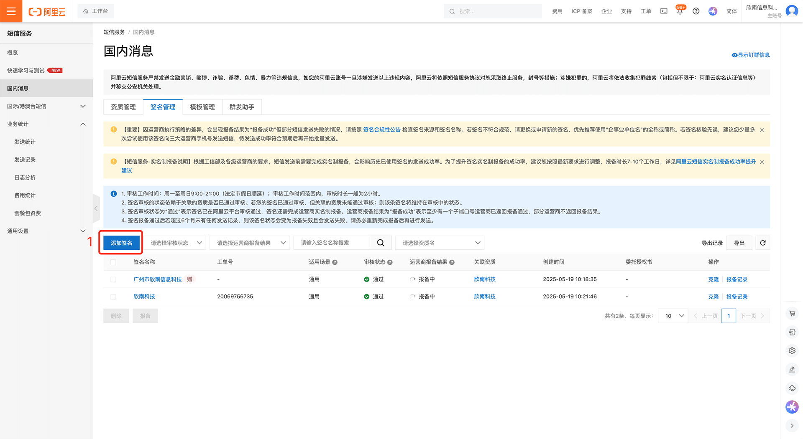
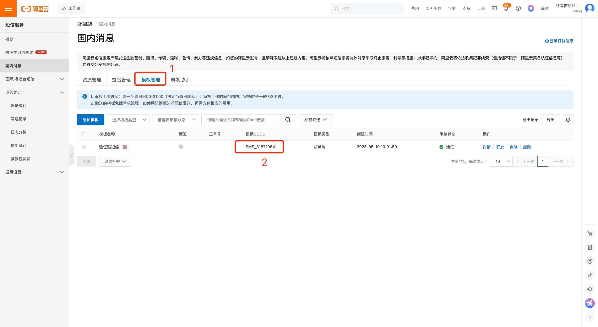
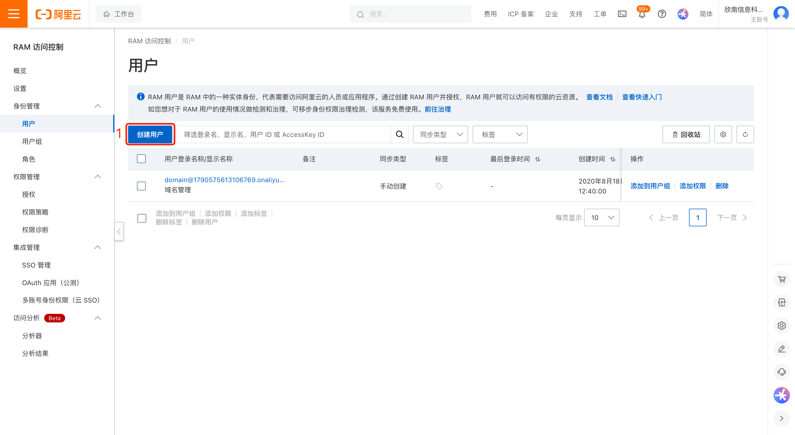
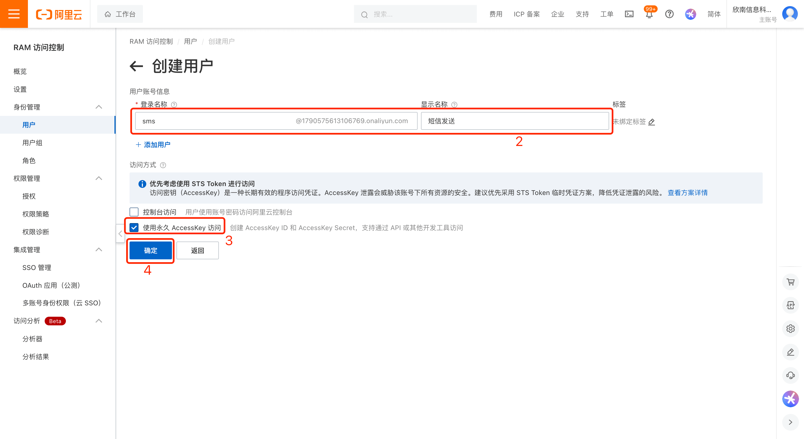
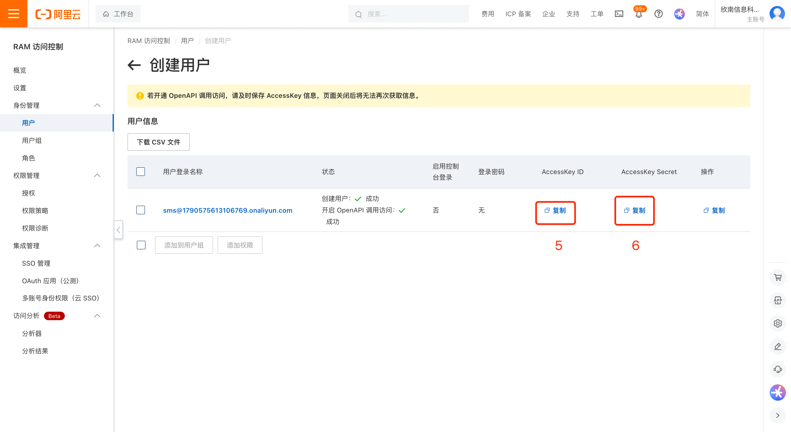
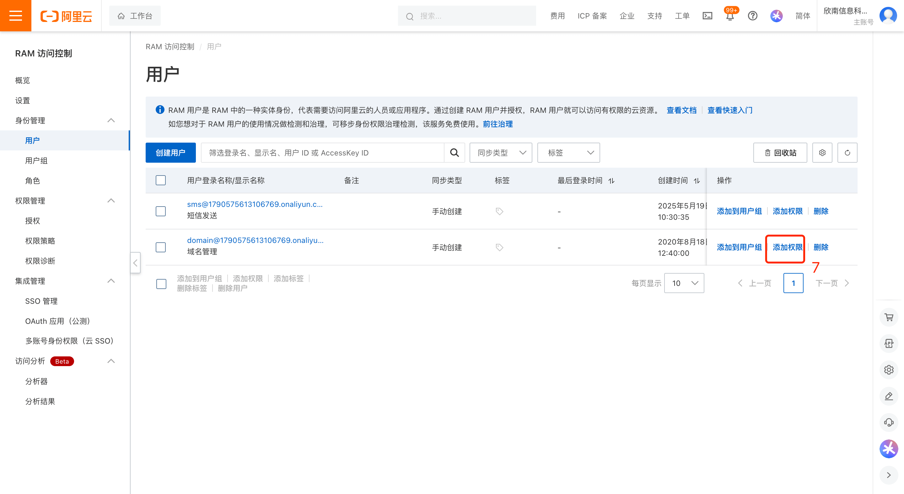
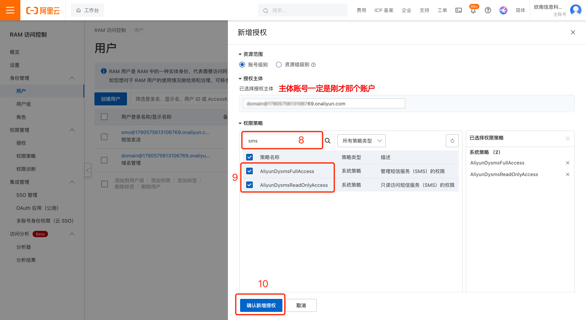
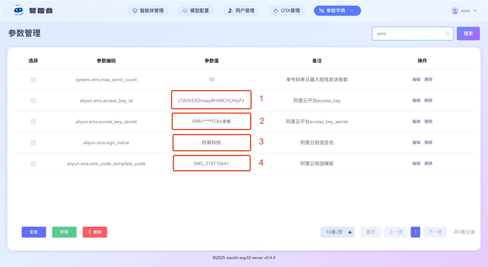
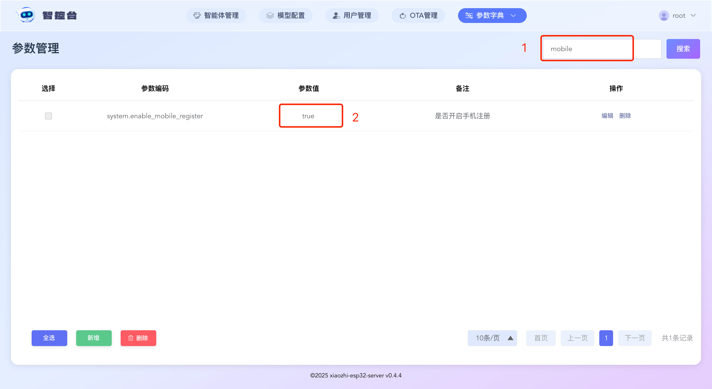

# 阿里云短信集成指南
## 第一步 添加签名

以上步骤，会得到签名，请把它写入到智控台参数，`aliyun.sms.sign_name`

## 第二步 添加模版

以上步骤，会得到模版code，请把它写入到智控台参数，`aliyun.sms.sms_code_template_code`

注意，签名要等7个工作日，等运营商报备成功后才能发送成功。

注意，签名要等7个工作日，等运营商报备成功后才能发送成功。

注意，签名要等7个工作日，等运营商报备成功后才能发送成功。

可以等报备成功后，再继续往下操作。

## 第三步 创建短信账户和开通权限

以上步骤，会得到access_key_id和access_key_secret，请把它写入到智控台参数，`aliyun.sms.access_key_id`、`aliyun.sms.access_key_secret`
## 第四步 启动手机注册功能

1、正常来说，以上信息都填完后，会有这个效果

2、开启允许非管理员用户可注册，将参数`server.allow_user_register`设置成`true`

3、开启手机注册功能，将参数`system.enable_mobile_register`设置成`true`
