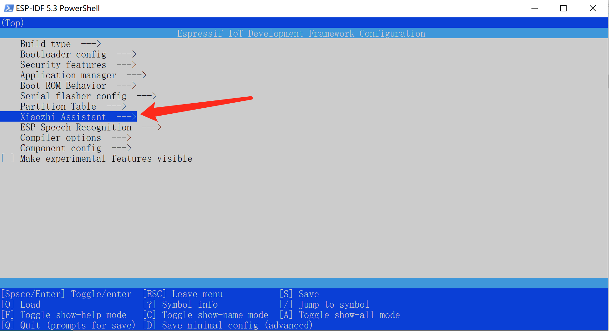
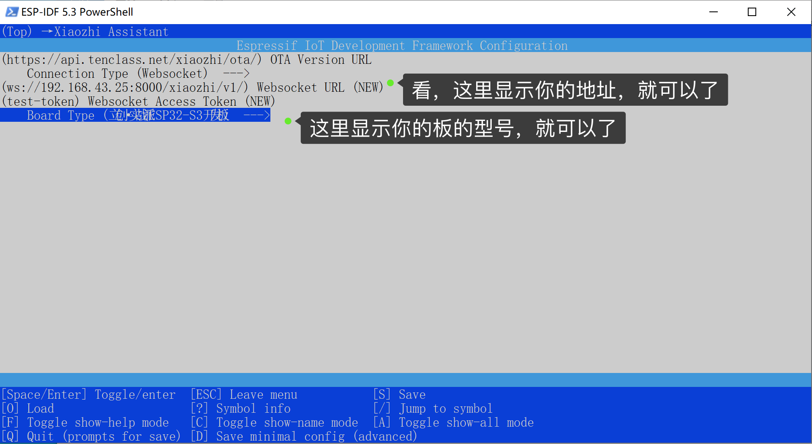
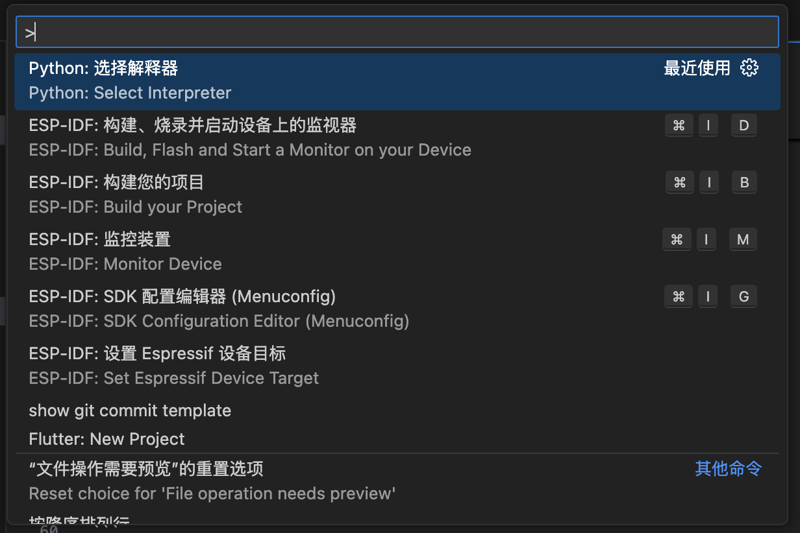

# 编译esp32固件

1. 先按照这个教程配置项目环境[《Windows搭建 ESP IDF 5.3.2开发环境以及编译小智》](https://icnynnzcwou8.feishu.cn/wiki/JEYDwTTALi5s2zkGlFGcDiRknXf)

2. 配置好编译环境后，下载虾哥[xiaozhi-esp32](https://github.com/78/xiaozhi-esp32)项目源码，进入虾哥项目，打开`xiaozhi-esp32/main/Kconfig.projbuild`文件，找到`WEBSOCKET_URL`的`default`的内容，把`wss://api.tenclass.net`
   改成你自己的地址，例如，我的接口地址是`ws://192.168.1.25:8000/xiaozhi/v1/`，就把内容改成这个。

修改前：

```
config WEBSOCKET_URL
    depends on CONNECTION_TYPE_WEBSOCKET
    string "Websocket URL"
    default "wss://api.tenclass.net/xiaozhi/v1/"
    help
        Communication with the server through websocket after wake up.
```

修改后(示例)：

```
config WEBSOCKET_URL
    depends on CONNECTION_TYPE_WEBSOCKET
    string "Websocket URL"
    default "ws://192.168.1.25:8000/xiaozhi/v1/"
    help
        Communication with the server through websocket after wake up.
```

注意：你的地址是`ws://`开头，不是`wss://`开头，一定不要写错了。

注意：你的地址是`ws://`开头，不是`wss://`开头，一定不要写错了。

注意：你的地址是`ws://`开头，不是`wss://`开头，一定不要写错了。

3. 设置编译参数

```
# 终端命令行进入xiaozhi-esp32的根目录
cd xiaozhi-esp32
# 例如我使用的板子是esp32s3，所以设置编译目标为esp32s3，如果你的板子是其他型号，请替换成对应的型号
idf.py set-target esp32s3
# 进入菜单配置
idf.py menuconfig
```



进入菜单配置后，再进入`Xiaozhi Assistant`，将`CONNECTION_TYPE`设置为`Websocket`
回退到主菜单，再进入`Xiaozhi Assistant`，将`BOARD_TYPE`设置你板子的具体型号
保存退出，回到终端命令行。



4. 编译固件

```
idf.py build
```

如果是vscode安装的idf可以使用`F1`或者`ctrl+shift+p`,输入idf然后直接选择进行编译

还可以直接进行烧录不用接下来的操作



5. 打包bin固件

```
cd scripts
python release.py
```

编译成功后，会在项目根目录下的`build`目录下生成固件文件`merged-binary.bin`。
这个`merged-binary.bin`就是要烧录到硬件上的固件文件。

注意：如果执行到第二命令后，报了“zip”相关的错误，请忽略这个错误，只要`build`目录下生成固件文件`merged-binary.bin`
，对你没有太大影响，请继续。

6. 烧录固件
   将esp32设备连接电脑，使用chrome浏览器，打开以下网址

```
https://espressif.github.io/esp-launchpad/
```

打开这个教程，[Flash工具/Web端烧录固件（无IDF开发环境）](https://ccnphfhqs21z.feishu.cn/wiki/Zpz4wXBtdimBrLk25WdcXzxcnNS)。
翻到：`方式二：ESP-Launchpad 浏览器WEB端烧录`，从`3. 烧录固件/下载到开发板`开始，按照教程操作。

烧录成功且联网成功后，通过唤醒词唤醒小智，留意server端输出的控制台信息。

以下是一些常见问题，供参考：

[1、为什么我说的话，小智识别出来很多韩文、日文、英文](./FAQ.md)

[2、为什么会出现“TTS 任务出错 文件不存在”？](./FAQ.md)

[3、TTS 经常失败，经常超时](./FAQ.md)

[4、使用Wifi能连接自建服务器，但是4G模式却接不上](./FAQ.md)

[5、如何提高小智对话响应速度？](./FAQ.md)

[6、我说话很慢，停顿时小智老是抢话](./FAQ.md)

[7、我想通过小智控制电灯、空调、远程开关机等操作](./FAQ.md)
