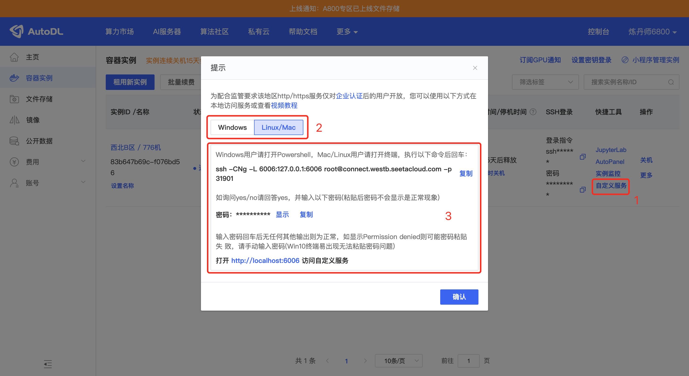
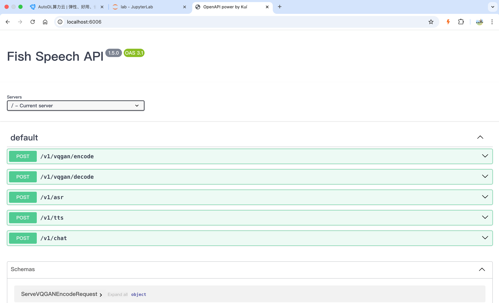

登录AutoDL，租赁镜像
选择镜像:
```
PyTorch / 2.1.0 / 3.10(ubuntu22.04) / cuda 12.1
```

机器开机后，设置学术加速
```
source /etc/network_turbo
```

进入工作目录
```
cd autodl-tmp/
```

拉取项目
```
git clone https://gitclone.com/github.com/fishaudio/fish-speech.git ; cd fish-speech
```

安装依赖
```
pip install -e.
```

如果报错，安装portaudio
```
apt-get install portaudio19-dev -y
```

安装后执行
```
pip install torch==2.3.1 torchvision==0.18.1 torchaudio==2.3.1 --index-url https://download.pytorch.org/whl/cu121
```

下载模型
```
cd tools
python download_models.py 
```

下载完模型后运行接口
```
python -m tools.api_server --listen 0.0.0.0:6006 
```

然后用浏览器去到aotodl实例页面
```
https://autodl.com/console/instance/list
```

如下图点击你刚才机器的`自定义服务`按钮，开启端口转发服务


端口转发服务设置完成后，你本地电脑打开网址`http://localhost:6006/`，就可以访问fish-speech的接口了



如果你是单模块部署，核心配置如下
```
selected_module:
  TTS: FishSpeech
TTS:
  FishSpeech:
    reference_audio: ["config/assets/wakeup_words.wav",]
    reference_text: ["哈啰啊，我是小智啦，声音好听的台湾女孩一枚，超开心认识你耶，最近在忙啥，别忘了给我来点有趣的料哦，我超爱听八卦的啦",]
    api_key: "123"
    api_url: "http://127.0.0.1:6006/v1/tts"
```

然后重启服务