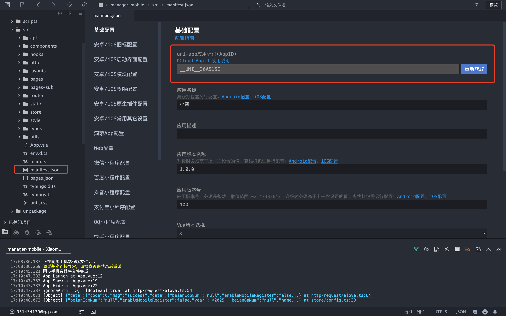
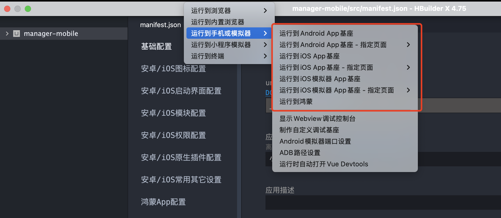
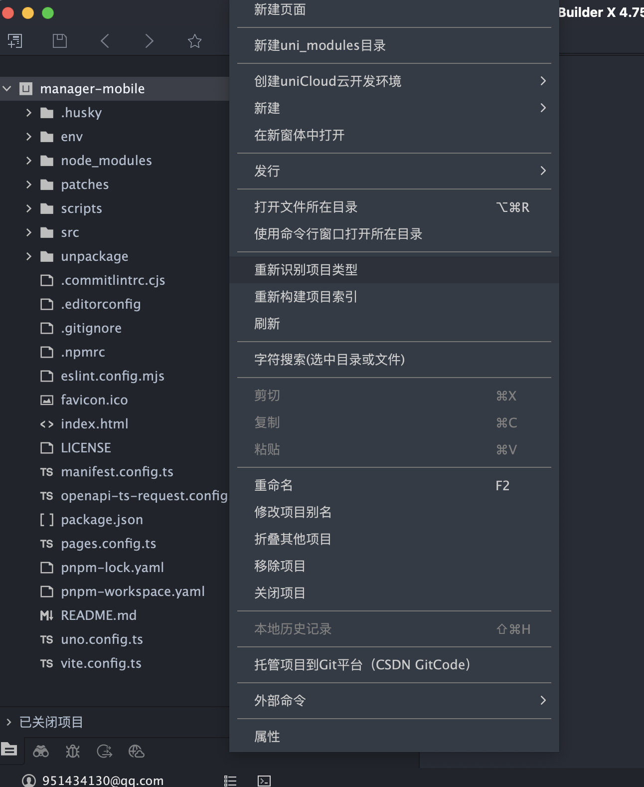
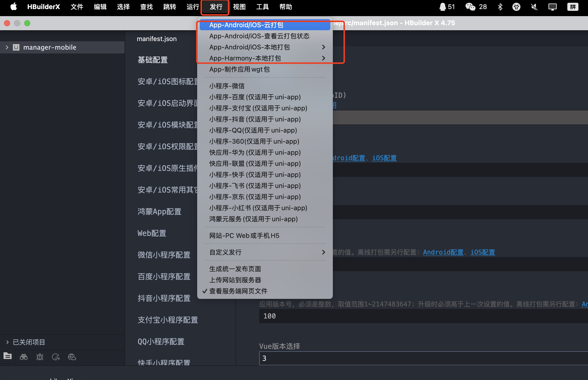
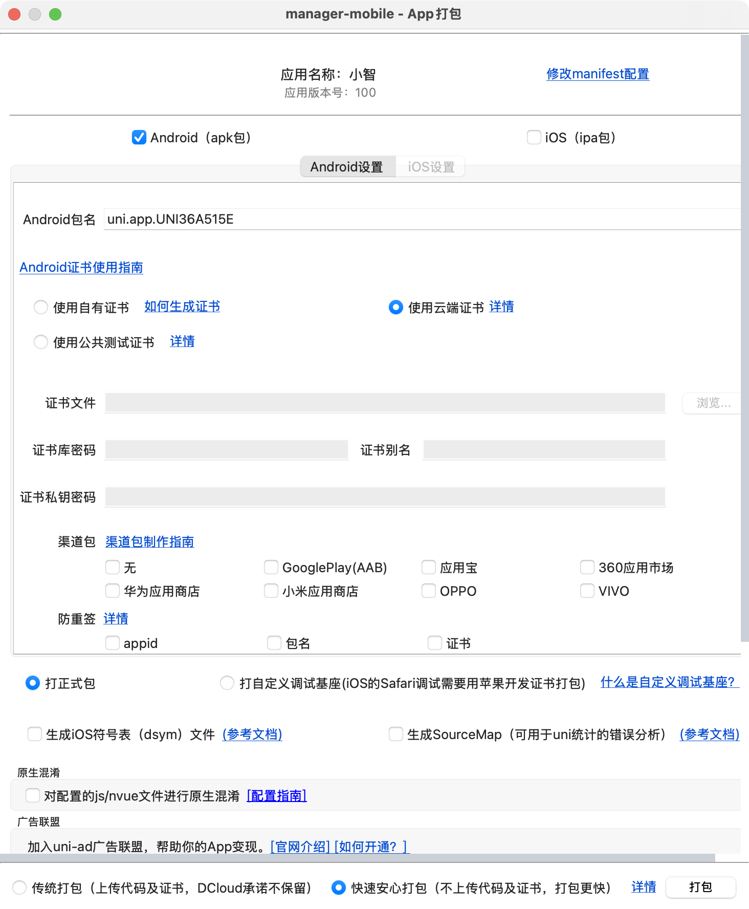

## 智控台移动版（manager-mobile）
基于 uni-app v3 + Vue 3 + Vite 的跨端移动管理端，支持 App（Android & iOS）和微信小程序。

### 平台兼容性

| H5 | iOS | Android | 微信小程序 |
| -- | --- | ------- | ---------- | 
| √  | √   | √       | √          | 

提示：不同 UI 组件在不同平台的适配度略有差异，请以对应组件库文档为准。

### 开发环境要求
- Node >= 18
- pnpm >= 7.30（建议使用项目中声明的 `pnpm@10.x`）
- 可选：HBuilderX（App 调试/打包）、微信开发者工具（微信小程序）

### 快速开始
1) 配置环境变量
   - 复制 `env/.env.example` 为 `env/.env.development`
   - 根据实际情况修改配置项（特别是 `VITE_SERVER_BASEURL`、`VITE_UNI_APPID`、`VITE_WX_APPID`）

2) 安装依赖

```bash
pnpm i
```

3) 本地开发（热更新）
- h5: `pnpm dev:h5`，然后观察启动日志显示的ip端口号
- 微信小程序：`pnpm dev:mp` 或 `pnpm dev:mp-weixin`，然后用微信开发者工具导入 `dist/dev/mp-weixin`
- App：用 HBuilderX 导入 `manager-mobile`，然后参考下面的教程就能运行了

### 环境变量与配置
项目使用自定义 `env` 目录存放环境文件，按 Vite 规范命名：`.env.development`、`.env.production` 等。

关键变量（部分）：
- VITE_APP_TITLE：应用名称（写入 `manifest.config.ts`）
- VITE_UNI_APPID：uni-app 应用 appid（App）
- VITE_WX_APPID：微信小程序 appid（mp-weixin）
- VITE_FALLBACK_LOCALE：默认语言，如 `zh-Hans`
- VITE_SERVER_BASEURL：服务端基础地址（HTTP 请求 baseURL）
- VITE_DELETE_CONSOLE：构建时是否移除 console（`true`/`false`）
- VITE_SHOW_SOURCEMAP：是否生成 sourcemap（默认关闭）
- VITE_LOGIN_URL：未登录跳转的登录页路径（路由拦截器使用）

示例（`env/.env.development`）：
```env
VITE_APP_TITLE=小智
VITE_FALLBACK_LOCALE=zh-Hans
VITE_UNI_APPID=
VITE_WX_APPID=

VITE_SERVER_BASEURL=http://localhost:8080

VITE_DELETE_CONSOLE=false
VITE_SHOW_SOURCEMAP=false
VITE_LOGIN_URL=/pages/login/index
```

说明：
- `manifest.config.ts` 会从 `env` 读取标题、appid、语言等配置。

### 重要注意事项
⚠️ **部署前必须修改的配置项：**

1. **应用 ID 配置**
   - `VITE_UNI_APPID`：需要在 [DCloud 开发者中心](https://dev.dcloud.net.cn/) 创建应用并获取 AppID
   - `VITE_WX_APPID`：需要在 [微信公众平台](https://mp.weixin.qq.com/) 注册小程序并获取 AppID

2. **服务端地址**
   - `VITE_SERVER_BASEURL`：修改为您的实际服务端地址

3. **应用信息**
   - `VITE_APP_TITLE`：修改为您的应用名称
   - 更新 `src/static/logo.png` 等图标资源

4. **其他配置**
   - 检查 `manifest.config.ts` 中的应用配置信息
   - 根据需要修改 `src/layouts/fg-tabbar/tabbarList.ts` 中的 tabbar 配置

### 详细操作指南

#### 1. 获取 uni-app AppID

- 复制生成的 AppID 到环境变量 `VITE_UNI_APPID` 中

#### 2. 本地运行步骤


**App 本地调试：**
1. 用 HBuilderX 导入 `manager-mobile` 目录
2. 重新识别项目
3. 连接手机或使用模拟器进行真机调试

**项目识别问题解决：**


如果 HBuilderX 无法正确识别项目类型：
- 在项目根目录右键选择"重新识别项目类型"
- 确保项目被识别为 "uni-app" 项目

### 路由与鉴权
- 在 `src/main.ts` 中注册了路由拦截插件 `routeInterceptor`。
- 黑名单拦截：仅对配置为需要登录的页面进行校验（来源 `@/utils` 的 `getNeedLoginPages`）。
- 登录判断：基于用户信息（`pinia` 的 `useUserStore`），未登录将跳转到 `VITE_LOGIN_URL`，并附带重定向回原页面的参数。

### 网络请求
- 基于 `alova` + `@alova/adapter-uniapp`，统一在 `src/http/request/alova.ts` 创建实例。
- `baseURL` 读取环境配置（`getEnvBaseUrl`），可通过 `method.config.meta.domain` 动态切换域名。
- 认证：默认从本地 `token`（`uni.getStorageSync('token')`）注入 `Authorization` 头，缺失则重定向登录。
- 响应：统一处理 `statusCode !== 200` 的 HTTP 错误与业务 `code !== 0` 的错误；`401` 会清除 token 并跳转登录。

### 构建与发布

**微信小程序：**
1. 确保已配置正确的 `VITE_WX_APPID`
2. 运行 `pnpm build:mp`，产物在 `dist/build/mp-weixin`
3. 用微信开发者工具导入项目目录，并上传代码
4. 在微信公众平台提交审核

**Android & iOS App：**

#### 3. App 打包发行步骤

**步骤一：准备打包**


1. 确保已配置正确的 `VITE_UNI_APPID`
2. 运行 `pnpm build:app`，产物在 `dist/build/app`
3. 用 HBuilderX 导入项目目录
4. 在 HBuilderX 中点击"发行" → "原生App-云打包"

**步骤二：配置打包参数**


1. **应用图标和启动图**：上传应用图标和启动页面图片
2. **应用版本号**：设置版本号和版本名称
3. **签名证书**：
   - Android：上传 keystore 证书文件
   - iOS：配置开发者证书和描述文件
4. **包名配置**：设置应用的包名（Bundle ID）
5. **打包类型**：选择测试包或正式包
6. 点击"打包"开始云打包流程

**发布到应用商店：**
- **Android**：将生成的 APK 文件上传到各大 Android 应用市场
- **iOS**：将生成的 IPA 文件通过 App Store Connect 上传到 App Store（需要 Apple 开发者账号）

### 约定与工程化
- 页面与分包：由 `@uni-helper/vite-plugin-uni-pages` 与 `pages.config.ts` 统一生成；tabbar 配置在 `src/layouts/fg-tabbar/tabbarList.ts`。
- 组件与 hooks 自动导入：见 `vite.config.ts` 中 `unplugin-auto-import` 与 `@uni-helper/vite-plugin-uni-components`。
- 样式：使用 UnoCSS 与 `src/style/index.scss`。
- 状态管理：`pinia` + `pinia-plugin-persistedstate`。
- 代码规范：内置 `eslint`、`husky`、`lint-staged`，提交前自动格式化（`lint-staged`）。

### 常用脚本
```bash
# 开发
pnpm dev:mp        # 等价 dev:mp-weixin

# 构建
pnpm build:mp      # 等价 build:mp-weixin

# 其他
pnpm type-check
pnpm lint && pnpm lint:fix
```

### License
MIT
