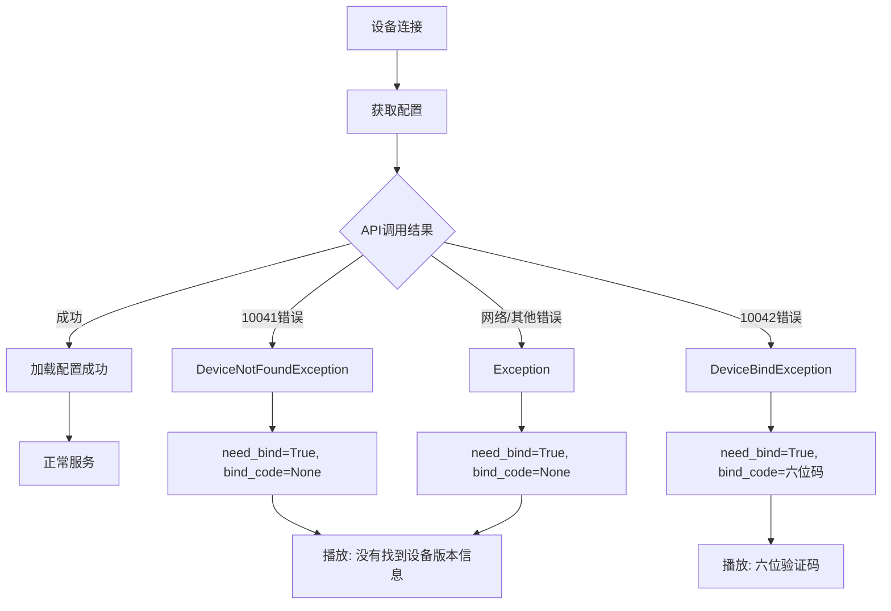

# XiaoZhi ESP32 Server 智能体信息绑定与获取逻辑分析

## 概述

本文档详细分析了 XiaoZhi ESP32 Server 中关于智能体信息绑定和获取的相关逻辑，包括设备首次登录验证码获取、OTA版本判断、智能体配置获取等核心流程。

## 1. 设备首次登录与六位验证码获取逻辑

### 1.1 核心流程

设备首次登录时的六位验证码获取逻辑主要涉及以下文件：

- **`core/connection.py:447-473`**: 私有配置初始化
- **`core/handle/receiveAudioHandle.py:129-162`**: 绑定设备检查
- **`config/manage_api_client.py:15-18`**: 设备绑定异常定义

### 1.2 详细分析

#### 1.2.1 设备绑定状态判断
在 `core/connection.py` 的 `_initialize_private_config()` 方法中：

```python
try:
    private_config = get_private_config_from_api(
        self.config,
        self.headers.get("device-id"),
        self.headers.get("client-id", self.headers.get("device-id")),
    )
except DeviceNotFoundException as e:
    self.need_bind = True
    private_config = {}
except DeviceBindException as e:
    self.need_bind = True
    self.bind_code = e.bind_code  # 从API获取六位绑定码
    private_config = {}
```

#### 1.2.2 六位验证码生成与存储
- **生成源**: 六位验证码由管理API服务器生成并返回
- **传递方式**: 通过 `DeviceBindException` 异常传递给客户端
- **存储位置**: 存储在连接对象的 `bind_code` 属性中

#### 1.2.3 验证码播放逻辑
在 `core/handle/receiveAudioHandle.py` 的 `check_bind_device()` 方法中：

```python
if conn.bind_code:
    # 验证码格式检查：必须是6位数字
    if len(conn.bind_code) != 6:
        conn.logger.bind(tag=TAG).error(f"无效的绑定码格式: {conn.bind_code}")
        text = "绑定码格式错误，请检查配置。"
        return
    
    # 语音提示
    text = f"请登录控制面板，输入{conn.bind_code}，绑定设备。"
    
    # 播放提示音和数字
    music_path = "config/assets/bind_code.wav"  # 主提示音
    for i in range(6):
        digit = conn.bind_code[i]
        num_path = f"config/assets/bind_code/{digit}.wav"  # 单个数字音频
```

#### 1.2.4 音频资源结构
```
config/assets/
├── bind_code.wav          # 绑定码提示音
├── bind_code/             # 数字音频文件夹
│   ├── 0.wav             # 数字0的音频
│   ├── 1.wav             # 数字1的音频
│   ├── ...
│   └── 9.wav             # 数字9的音频
└── bind_not_found.wav     # 未找到设备信息的提示音
```

## 2. OTA版本判断逻辑

### 2.1 核心文件
- **`core/api/ota_handler.py`**: OTA接口处理器

### 2.2 版本判断流程

#### 2.2.1 OTA请求处理
在 `core/api/ota_handler.py` 的 `handle_post()` 方法中：

```python
async def handle_post(self, request):
    data_json = json.loads(data)
    
    return_json = {
        "firmware": {
            "version": data_json["application"].get("version", "1.0.0"),  # 从设备上报的版本
            "url": "",  # 固件下载地址（空表示无更新）
        },
        "websocket": {
            "url": self._get_websocket_url(local_ip, port),  # WebSocket连接地址
        },
    }
```

#### 2.2.2 版本判断机制
- **当前实现**: 简单回显设备上报的版本号
- **升级判断**: 通过 `url` 字段为空表示无需升级
- **扩展可能**: 可在此处添加版本比较逻辑

#### 2.2.3 WebSocket地址生成
```python
def _get_websocket_url(self, local_ip: str, port: int) -> str:
    server_config = self.config["server"]
    websocket_config = server_config.get("websocket", "")
    
    if "你的" not in websocket_config:
        return websocket_config  # 使用配置中的自定义地址
    else:
        return f"ws://{local_ip}:{port}/xiaozhi/v1/"  # 自动生成地址
```

## 3. 智能体配置获取逻辑

### 3.1 核心组件

#### 3.1.1 配置获取流程
**文件位置**: `config/config_loader.py:74-76`

```python
def get_private_config_from_api(config, device_id, client_id):
    """从Java API获取私有配置"""
    return get_agent_models(device_id, client_id, config["selected_module"])
```

#### 3.1.2 API客户端实现
**文件位置**: `config/manage_api_client.py:133-145`

```python
def get_agent_models(mac_address: str, client_id: str, selected_module: Dict) -> Optional[Dict]:
    """获取代理模型配置"""
    return ManageApiClient._instance._execute_request(
        "POST",
        "/config/agent-models",
        json={
            "macAddress": mac_address,
            "clientId": client_id,
            "selectedModule": selected_module,
        },
    )
```

### 3.2 配置应用逻辑

#### 3.2.1 差异化配置更新
**文件位置**: `core/connection.py:447-571`

配置更新包括以下模块：
- **VAD** (Voice Activity Detection): 语音活动检测
- **ASR** (Automatic Speech Recognition): 语音识别
- **LLM** (Large Language Model): 大语言模型
- **TTS** (Text-to-Speech): 语音合成
- **VLLM** (Vision Language Model): 视觉语言模型
- **Memory**: 记忆模块
- **Intent**: 意图识别

#### 3.2.2 配置项说明
```python
# 主要配置更新逻辑
if private_config.get("TTS", None) is not None:
    self.config["TTS"] = private_config["TTS"]
    self.config["selected_module"]["TTS"] = private_config["selected_module"]["TTS"]

if private_config.get("LLM", None) is not None:
    self.config["LLM"] = private_config["LLM"]
    self.config["selected_module"]["LLM"] = private_config["selected_module"]["LLM"]

# 插件配置加载
if model_intent != "Intent_nointent":
    plugin_from_server = private_config.get("plugins", {})
    for plugin, config_str in plugin_from_server.items():
        plugin_from_server[plugin] = json.loads(config_str)
    self.config["plugins"] = plugin_from_server
```

## 4. 设备认证与绑定流程

### 4.1 认证机制

#### 4.1.1 认证中间件
**文件位置**: `core/auth.py`

```python
class AuthMiddleware:
    async def authenticate(self, headers):
        # 检查是否启用认证
        if not self.auth_config.get("enabled", False):
            return True
        
        # 设备白名单检查
        device_id = headers.get("device-id", "")
        if self.allowed_devices and device_id in self.allowed_devices:
            return True
        
        # Token认证
        auth_header = headers.get("authorization", "")
        if not auth_header.startswith("Bearer "):
            raise AuthenticationError("Missing or invalid Authorization header")
        
        token = auth_header.split(" ")[1]
        if token not in self.tokens:
            raise AuthenticationError("Invalid token")
```

#### 4.1.2 认证配置
**文件位置**: `config.yaml:31-43`

```yaml
auth:
  enabled: false
  tokens:
    - token: "your-token1"
      name: "your-device-name1"
    - token: "your-token2"
      name: "your-device-name2"
  allowed_devices:
    - "24:0A:C4:1D:3B:F0"  # MAC地址白名单
```

### 4.2 绑定流程状态机

#### 4.2.1 状态定义
```python
# 连接状态
self.need_bind = False      # 是否需要绑定
self.bind_code = None       # 六位绑定码
self.read_config_from_api   # 是否从API读取配置
```

#### 4.2.2 状态转换


## 5. 错误处理与异常机制

### 5.1 异常类型定义

#### 5.1.1 设备相关异常
**文件位置**: `config/manage_api_client.py:11-18`

```python
class DeviceNotFoundException(Exception):
    """设备未找到异常"""
    pass

class DeviceBindException(Exception):
    """设备绑定异常，包含六位绑定码"""
    def __init__(self, bind_code):
        self.bind_code = bind_code
        super().__init__(f"设备绑定异常，绑定码: {bind_code}")
```

### 5.2 "没有找到该设备的版本信息"错误分析

#### 5.2.1 错误触发条件
**文件位置**: `core/handle/receiveAudioHandle.py:157-162`

该错误会在以下情况下出现：

```python
async def check_bind_device(conn):
    if conn.bind_code:
        # 有绑定码时播放六位验证码
        ...
    else:
        # 没有绑定码时报告设备版本信息未找到错误
        text = f"没有找到该设备的版本信息，请正确配置 OTA地址，然后重新编译固件。"
        await send_stt_message(conn, text)
        music_path = "config/assets/bind_not_found.wav"
        opus_packets, _ = audio_to_data(music_path)
        conn.tts.tts_audio_queue.put((SentenceType.LAST, opus_packets, text))
```

#### 5.2.2 bind_code申请的触发条件

**关键发现**: `bind_code`的申请不是客户端主动发起的，而是管理平台根据设备状态自动决定的。

API调用`/config/agent-models`时，管理平台会根据设备状态返回不同的响应：

**情况1: 设备预注册状态（返回10042 + 绑定码）**
```
设备连接 → 调用get_private_config_from_api() → API返回10042错误码
→ 触发DeviceBindException(bind_code) → need_bind=True, bind_code=六位数字
→ 播放六位绑定码音频
```

**触发条件**：
- 管理员在平台中预先添加了设备信息（MAC地址、设备类型等）
- 设备状态为"已添加但未绑定"
- 设备在允许的租户/组织范围内
- 设备类型和固件版本受支持

**情况2: 设备完全未知（返回10041，无绑定码）**
```
设备连接 → 调用get_private_config_from_api() → API返回10041错误码
→ 触发DeviceNotFoundException → need_bind=True, bind_code=None
→ 播放"没有找到该设备的版本信息"错误
```

**触发条件**：
- 设备从未在管理平台中出现过
- 设备被管理员禁用或删除
- 设备在黑名单中
- 设备不属于当前API调用者的权限范围
- 设备类型不受支持或固件版本过旧

**情况3: API网络异常或其他错误**
**文件位置**: `core/connection.py:470-473`
```python
except Exception as e:
    self.need_bind = True        # 设置需要绑定
    # 但没有设置bind_code，保持为None
    self.logger.bind(tag=TAG).error(f"获取差异化配置失败: {e}")
    private_config = {}
```

**触发条件**：
- API URL配置错误
- API secret配置错误
- 网络连接异常
- API服务不可访问
- API返回非预期格式数据

#### 5.2.3 错误与绑定码播放的区别

| 条件 | conn.need_bind | conn.bind_code | 结果行为 |
|------|----------------|----------------|----------|
| 设备已注册 | False | - | 正常服务 |
| 设备需要绑定且API返回绑定码 | True | 六位数字 | 播放绑定码 |
| 设备未注册且API未返回绑定码 | True | None | 播放"版本信息未找到"错误 |
| API异常/网络错误 | True | None | 播放"版本信息未找到"错误 |

#### 5.2.4 解决方案

**问题排查步骤：**

1. **检查设备OTA配置**
   - 确保设备固件中OTA URL配置正确
   - 验证设备能够访问到服务器的OTA接口

2. **检查管理API配置**
   ```yaml
   # data/.config.yaml
   manager-api:
     url: "https://your-management-server.com"  # 确保URL正确
     secret: "your-api-secret"                   # 确保密钥正确
   ```

3. **检查网络连接**
   - 验证服务器到管理API的网络连通性
   - 检查防火墙和代理配置

4. **检查API服务状态**
   - 确认管理API服务正常运行
   - 查看API服务日志确认设备注册状态

**解决方法：**

**针对"没有找到设备版本信息"错误：**

- **方法1**: **在管理平台中预注册设备**
  - 登录智控台/管理平台
  - 添加新设备：输入设备MAC地址、设备名称、设备类型等
  - 将设备状态设置为"待绑定"
  - 重新连接设备，此时应该会返回六位绑定码

- **方法2**: **检查设备权限和状态**
  - 确认设备未被禁用或删除
  - 检查设备是否在正确的租户/组织下
  - 验证当前API用户有权限访问该设备

- **方法3**: **修复技术配置问题**
  - 检查并修正API URL和密钥配置
  - 验证网络连接和防火墙设置
  - 确认管理API服务正常运行

- **方法4**: **设备端配置检查**
  - 验证设备MAC地址正确上报
  - 确认设备固件版本受支持
  - 重新编译固件，确保OTA地址配置正确

**关键操作步骤**：
```
管理员操作：预注册设备 → 设备连接 → 获得绑定码 → 用户输入绑定码 → 设备激活
```

### 5.3 认证异常
**文件位置**: `core/auth.py:7-9`

```python
class AuthenticationError(Exception):
    """认证异常"""
    pass
```

### 5.4 API错误处理

#### 5.4.1 统一错误处理
**文件位置**: `config/manage_api_client.py:71-77`

```python
# 处理API返回的业务错误
if result.get("code") == 10041:
    raise DeviceNotFoundException(result.get("msg"))
elif result.get("code") == 10042:
    raise DeviceBindException(result.get("msg"))  # msg为六位验证码
elif result.get("code") != 0:
    raise Exception(f"API返回错误: {result.get('msg', '未知错误')}")
```

## 6. 配置文件结构

### 6.1 配置层级

#### 6.1.1 配置文件优先级
1. **API配置** (`read_config_from_api: true`): 最高优先级，从管理平台获取
2. **用户配置** (`data/.config.yaml`): 用户自定义配置，覆盖默认配置
3. **默认配置** (`config.yaml`): 系统默认配置

#### 6.1.2 配置合并逻辑
**文件位置**: `config/config_loader.py:18-44`

```python
def load_config():
    if custom_config.get("manager-api", {}).get("url"):
        config = get_config_from_api(custom_config)  # 从API获取
    else:
        config = merge_configs(default_config, custom_config)  # 本地合并
```

### 6.2 关键配置项

#### 6.2.1 管理API配置
```yaml
manager-api:
  url: "https://your-api-server.com"
  secret: "your-api-secret"
  timeout: 30
  max_retries: 6
  retry_delay: 10
```

#### 6.2.2 服务器配置
```yaml
server:
  ip: 0.0.0.0
  port: 8000
  http_port: 8003
  websocket: "ws://your-domain:port/xiaozhi/v1/"
  vision_explain: "http://your-domain:port/mcp/vision/explain"
```

## 7. 安全考虑

### 7.1 敏感信息处理

#### 7.1.1 配置信息过滤
**文件位置**: `core/utils/util.py` (推测存在filter_sensitive_info函数)

- API密钥不在日志中显示
- 设备Token信息脱敏处理
- 绑定码仅在必要时显示

#### 7.1.2 认证令牌管理
- Bearer Token认证
- 设备MAC地址白名单
- Token与设备名称映射关系

### 7.2 网络安全

#### 7.2.1 HTTPS支持
- API通信使用HTTPS
- WebSocket可配置为WSS
- CORS头部设置

#### 7.2.2 访问控制
- 设备级别的访问控制
- Token基础的身份验证
- 白名单机制

## 8. 监控与日志

### 8.1 日志记录

#### 8.1.1 关键日志点
```python
# 设备连接日志
self.logger.bind(tag=TAG).info(f"{self.client_ip} conn - Headers: {self.headers}")

# 配置获取日志
self.logger.bind(tag=TAG).info(f"获取差异化配置成功: {json.dumps(filter_sensitive_info(private_config))}")

# 绑定状态日志
self.logger.bind(tag=TAG).error(f"无效的绑定码格式: {conn.bind_code}")
```

#### 8.1.2 日志配置
**文件位置**: `config.yaml:44-56`

```yaml
log:
  log_format: "<green>{time:YYMMDD HH:mm:ss}</green>[{version}_{selected_module}]..."
  log_level: INFO
  log_dir: tmp
  log_file: "server.log"
```

### 8.2 性能监控

#### 8.2.1 配置获取性能
```python
begin_time = time.time()
private_config = get_private_config_from_api(...)
self.logger.bind(tag=TAG).info(f"{time.time() - begin_time} 秒，获取差异化配置成功")
```

#### 8.2.2 连接状态监控
- 连接超时检查
- 活动时间戳更新
- 资源使用情况

## 9. 扩展与定制

### 9.1 自定义绑定流程

#### 9.1.1 扩展点
- 自定义验证码生成算法
- 扩展音频提示内容
- 定制绑定确认机制

#### 9.1.2 配置扩展
- 添加新的设备类型支持
- 自定义认证方式
- 扩展配置项验证

### 9.2 API集成

#### 9.2.1 第三方集成
- 设备管理平台集成
- 用户权限系统集成
- 监控告警系统集成

#### 9.2.2 数据同步
- 配置变更同步
- 设备状态同步
- 用户行为数据上报

## 结论

XiaoZhi ESP32 Server的智能体信息绑定与获取逻辑设计完善，涵盖了设备认证、配置获取、版本管理等核心功能。系统采用了分层配置、异常驱动的绑定流程和完善的错误处理机制，确保了设备接入的安全性和可靠性。

主要特点：
1. **安全性**: 多层认证机制，敏感信息保护
2. **灵活性**: 支持本地和远程配置管理
3. **可扩展性**: 模块化设计，易于功能扩展
4. **可维护性**: 完善的日志记录和错误处理
5. **用户体验**: 音频引导的绑定流程，降低操作复杂度